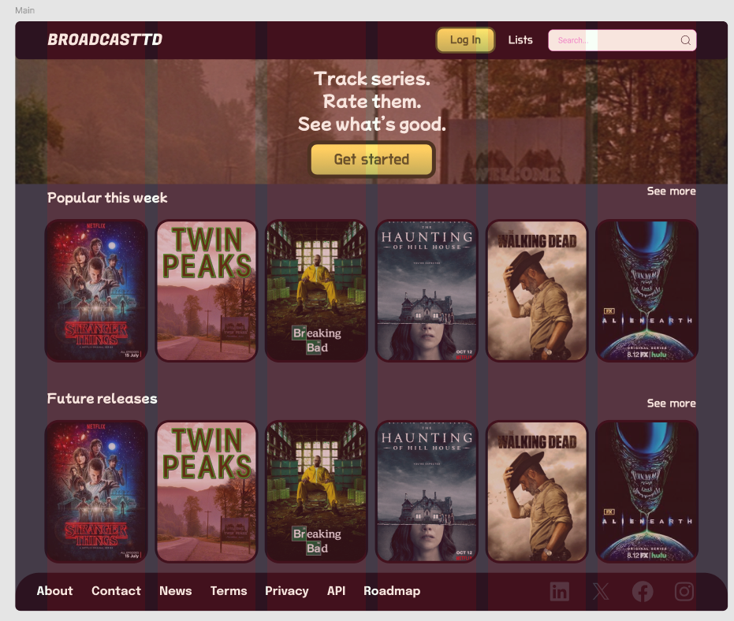

# Sección 1: Arquitectura CSS y comunicación visual.

## 1.1 Principios de comunicación visual: Explica los 5 principios básicos y cómo los aplicas en tu proyecto:

### Jerarquía: Cómo usas tamaños, pesos y espaciado para crear importancia visual

Para crear una jerarquía visual, en el proyecto de Figma todos los tamaños siguen una base de 4px, facilitando el trabajo con los elementos, de forma que muchos tienen espaciado de 24, 32, 48 o 64px dependiendo de qué se necesite. Por ejemplo, si se quiere mostrar varios elementos más agrupados, tendrán menos espaciado (32px), mientras que si se quiere separar del resto estos tendrán un espacio mayor (64px).


### Contraste: Cómo usas color, tamaño y peso para diferenciar elementos
    
Para poder llamar la atención visualmente, se ha escogido una paleta de colores morada y amarilla, una que alterna entre ambos colores en su modo claro y oscuro, de los cuales solo actualmente el modo oscuro se encuentra implementado en el proyecto de Figma:

- En el modo oscuro, el morado predomina como color principal, yendo desde más claro a más oscuro conforme más contenido en un contenedor un elemento se encuentre, con las letras y los botones siendo de colores más claros para que destaquen frente al resto de elementos. Esta idea no se ve tan reflejado dentro del proyecto de Figma, pero cambios provisionales dentro del proyecto llevado a código muestran una nueva propuesta de esta idea. 

Proyecto en Figma:


Página web provisional:


    
- De esta forma, el modo claro tendría una idea opuesta, donde el fondo sería mucho más oscuro y conforme se va incluyendo dentro de contenedores se va a aclarando. Esto sirve como contraste con la letra morada oscura.


### Alineación: Tu estrategia de alineación (izquierda, centro, grid)
    
Para mantener armonía en el proyecto, la mayoría de los elementos fueron centrados o, alternativamente, alineados con una grid, como se puede ver por los ejemplos por pantalla:




Además, la alineación se basaba en múltiplos de 12 para su espaciado.


### Proximidad: Cómo agrupas elementos relacionados con espaciado
    
Para mostrar que los elementos están agrupados, se ha utilizado un espaciado específico para diferencias entre cada componente:


### Repetición: Cómo creas coherencia repitiendo patrones visuales

A partir de una paleta de colores definida, una tipografía consistente, unos bordes redondeados y unas animaciones consistentes en todo el programa se logra una estética única de la página.


## 1.2 Metodología CSS: Explica qué metodología usas (BEM recomendado) y por qué. Muestra ejemplos de tu nomenclatura. Si usas BEM, explica que usarás bloques (.card), elementos (.card__title), y modificadores (.card--featured).

Se ha utilizado la metodología BEM, donde el bloque representa un componente independiente con significado propio, el elemento representa parte del bloque que no tiene significado independiente y el modificador es una variante del bloque o elemento.

Ejemplo en el código:


**Componente Button:**
```scss
// Bloque base
.btn {
  display: inline-flex;
  padding: var(--spacing-3) var(--spacing-6);
  border-radius: var(--radius-lg);
  /* ... */
}

// Elemento
.btn__content {
  display: flex;
  align-items: center;
  gap: var(--spacing-2);
}

// Modificadores de variante
.btn--primary {
  background-color: var(--color-primary);
  color: var(--color-white);
}

.btn--secondary {
  background-color: var(--color-secondary);
  color: var(--color-primary-dark);
}

.btn--ghost {
  background-color: transparent;
  border: 2px solid var(--color-primary);
}

// Modificadores de tamaño
.btn--sm {
  padding: var(--spacing-2) var(--spacing-4);
  font-size: var(--font-size-sm);
}

.btn--lg {
  padding: var(--spacing-4) var(--spacing-8);
  font-size: var(--font-size-lg);
}

// Modificador de estado
.btn--disabled {
  opacity: 0.5;
  cursor: not-allowed;
}
```

**Componente Card:**
```scss
// Bloque
.card {
  background: var(--color-box-level-1);
  border-radius: var(--radius-xl);
  overflow: hidden;
}

// Elementos
.card__image-wrapper {
  position: relative;
  overflow: hidden;
}

.card__image {
  width: 100%;
  height: auto;
  display: block;
}

.card__body {
  padding: var(--spacing-6);
}

.card__title {
  font-size: var(--font-size-xl);
  margin-bottom: var(--spacing-4);
}

.card__content {
  color: var(--color-text-primary);
}

.card__footer {
  padding: var(--spacing-4) var(--spacing-6);
  border-top: 1px solid var(--color-neutral-300);
}

// Modificadores
.card--rating {
  display: flex;
  flex-direction: column;
}

.card--featured {
  border: 2px solid var(--color-primary);
  box-shadow: var(--shadow-primary);
}
```

**Componente Form-Input:**
```scss
// Bloque
.form-input {
  display: flex;
  flex-direction: column;
  gap: var(--spacing-2);
}

// Elementos
.form-input__label {
  font-size: var(--font-size-sm);
  font-weight: var(--font-weight-medium);
  color: var(--color-text-primary);
}

.form-input__required {
  color: var(--color-error);
}

.form-input__field {
  padding: var(--spacing-3) var(--spacing-4);
  border: 2px solid var(--color-neutral-300);
  border-radius: var(--radius-md);
  font-size: var(--font-size-base);
}

.form-input__help {
  font-size: var(--font-size-xs);
  color: var(--color-text-secondary);
}

.form-input__error {
  font-size: var(--font-size-xs);
  color: var(--color-error);
}

// Modificadores
.form-input--error .form-input__field {
  border-color: var(--color-error);
}

.form-input--disabled .form-input__field {
  background-color: var(--color-neutral-200);
  cursor: not-allowed;
}
```


## 1.3 Organización de archivos: Documenta tu estructura ITCSS. Explica por qué cada carpeta está en ese orden (de menor a mayor especificidad). Muestra el árbol de carpetas completo.


### Estructura de carpetas del proyecto

```
src/styles/
├── _main.scss                      # Archivo principal (importa todo)
├── 00-settings/
│   └── _variables.scss            # Design tokens (CSS Custom Properties)
├── 01-tools/
│   └── _mixins.scss               # Mixins y funciones SCSS
├── 02-generic/
│   └── _reset.scss                # Reset CSS básico
├── 03-elements/
│   └── _base.scss                 # Estilos de elementos HTML
├── 04-objects/
│   └── _layout.scss               # Patrones de layout reutilizables
├── 05-components/
│   ├── _buttons.scss              # Estilos globales de botones
│   ├── _footer.scss               # Estilos del footer
│   └── _header.scss               # Estilos del header
└── 06-utilities/
    └── _helpers.scss              # Clases de utilidad
```

### Explicación de cada Capa

El orden se ha escogido porque cada carpeta depende de la anterior para funcionar (Settings -> Tools -> Generic -> ...), el principio de especidad creciente. Así, se evitan problemas de cascada.

- **Settings**: Define todas las variables CSS (Design Tokens) y contiene colores, tipografías, espaciados, breakpoints. 
- **Tools**: Son mixins y funciones SCSS reutilizables con mixins de responsive, flexbox, grid, transiciones
- **Elements**: Incluye estilos base de elementos HTML sin clases.
- **Objects**: Son patrones de layout reutilizables sin estética con containers, grids y wrappers.
- **Components**: Son componentes UI específicos con BEM.
- **Utilities**: Incluyen clases helper que modifican una sola propiedad


## 1.4 Sistema de Design Tokens: Documenta todas tus variables. Para cada grupo (colores, tipografía, espaciado, etc.) explica las decisiones:

### Por qué elegiste esos colores

    Debido a la estética de ocio y de fiesta que emite el morado y cómo se complementa con el amarillo, un color que representa la alegría, se escogieron ambos colores como principales

### Por qué esa escala tipográfica

    MochiyPopOne se escogió para transmitir un sentimiento de ocio, ya que es una aplicación web enfocada puramente a ello.

    Por otra parte, Do Hyeon se utilizó para la letra más pequeña para evocar un sentimiento más profesional, ya que se supone que es la tipografía más legible de entre los dos.

    De esta forma, una está enfocada a los títulos y la otra se encarga de mostrar el texto más legible.

    Además, se escogió una base de 1 rem por estándares web (16px), lo que facilita mucho más la edición y visibilización de elementos.


### Por qué esos breakpoints

    Se realizó de esta forma para adaptarlos a los siguientes formatos:

- **640px**: iPhone 13/14 en landscape, móviles grandes
- **768px**: iPad portrait, tablets estándar
- **1024px**: iPad landscape, laptops pequeños
- **1280px**: Laptops estándar (1366px es común)
- **1536px**: Monitores grandes, 4K


## 1.5 Mixins y funciones: Documenta cada mixin que creaste, para qué sirve, y muestra un ejemplo de uso.


### 1. Mixin: Responsive

**Propósito**: Facilitar la escritura de media queries para diferentes breakpoints.

**Código**:
```scss
@mixin responsive($breakpoint) {
  @if map-has-key($breakpoints, $breakpoint) {
    @media (min-width: map-get($breakpoints, $breakpoint)) {
      @content;
    }
  } @else {
    @warn "No existe el breakpoint `#{$breakpoint}`";
  }
}
```

**Ejemplo de uso**:
```scss
.elemento {
  font-size: 16px;
  padding: var(--spacing-4);
  
  @include responsive('md') {
    font-size: 18px;
    padding: var(--spacing-6);
  }
  
  @include responsive('lg') {
    font-size: 20px;
    padding: var(--spacing-8);
  }
}

// Compila a:
.elemento {
  font-size: 16px;
  padding: 1rem;
}

@media (min-width: 768px) {
  .elemento {
    font-size: 18px;
    padding: 1.5rem;
  }
}

@media (min-width: 1024px) {
  .elemento {
    font-size: 20px;
    padding: 2rem;
  }
}
```

### 2. Mixin: Responsive-Max

**Propósito**: Media queries con max-width (para casos especiales donde necesitamos estilos solo en móvil).

**Código**:
```scss
@mixin responsive-max($breakpoint) {
  @if map-has-key($breakpoints, $breakpoint) {
    @media (max-width: calc(#{map-get($breakpoints, $breakpoint)} - 1px)) {
      @content;
    }
  }
}
```

**Ejemplo de uso**:
```scss
.menu-mobile {
  display: block;
  
  @include responsive-max('md') {
    // Solo visible en pantallas menores a 768px
    position: fixed;
    bottom: 0;
  }
}
```

### 3. Mixin: Flex-Center

**Propósito**: Centrar elementos usando flexbox de forma rápida.

**Código**:
```scss
@mixin flex-center($direction: row, $gap: 0) {
  display: flex;
  flex-direction: $direction;
  justify-content: center;
  align-items: center;
  
  @if $gap != 0 {
    gap: $gap;
  }
}
```

**Ejemplo de uso**:
```scss
// Centrado horizontal y vertical
.modal-content {
  @include flex-center;
  min-height: 100vh;
}

// Centrado vertical (columna)
.hero {
  @include flex-center(column, var(--spacing-6));
  padding: var(--spacing-12);
}

// Compila a:
.modal-content {
  display: flex;
  flex-direction: row;
  justify-content: center;
  align-items: center;
  min-height: 100vh;
}

.hero {
  display: flex;
  flex-direction: column;
  justify-content: center;
  align-items: center;
  gap: 1.5rem;
  padding: 3rem;
}
```

### 4. Mixin: Flex-Between

**Propósito**: Distribuir elementos con espacio entre ellos (común en headers, cards).

**Código**:
```scss
@mixin flex-between($align: center) {
  display: flex;
  justify-content: space-between;
  align-items: $align;
}
```

**Ejemplo de uso**:
```scss
.card-header {
  @include flex-between;
  padding: var(--spacing-4);
}

.footer {
  @include flex-between(flex-start);
  padding: var(--spacing-8);
}

// Compila a:
.card-header {
  display: flex;
  justify-content: space-between;
  align-items: center;
  padding: 1rem;
}

.footer {
  display: flex;
  justify-content: space-between;
  align-items: flex-start;
  padding: 2rem;
}
```

### 5. Mixin: Grid-Center

**Propósito**: Centrar elementos usando CSS Grid (más simple que flexbox para centrado total).

**Código**:
```scss
@mixin grid-center {
  display: grid;
  place-items: center;
}
```

**Ejemplo de uso**:
```scss
.loading-spinner {
  @include grid-center;
  min-height: 200px;
}

// Compila a:
.loading-spinner {
  display: grid;
  place-items: center;
  min-height: 200px;
}
```

### 6. Mixin: Grid-Auto

**Propósito**: Grid responsive automático con columnas que se ajustan según el espacio disponible.

**Código**:
```scss
@mixin grid-auto($min-width: 15.625rem) {
  display: grid;
  grid-template-columns: repeat(auto-fit, minmax($min-width, 1fr));
  gap: var(--spacing-4);
}
```

**Ejemplo de uso**:
```scss
.products-grid {
  @include grid-auto(250px);
}

.cards-grid {
  @include grid-auto(300px);
  gap: var(--spacing-6); // Sobrescribe el gap por defecto
}

// Compila a:
.products-grid {
  display: grid;
  grid-template-columns: repeat(auto-fit, minmax(250px, 1fr));
  gap: 1rem;
}

.cards-grid {
  display: grid;
  grid-template-columns: repeat(auto-fit, minmax(300px, 1fr));
  gap: 1.5rem;
}
```

### 7. Mixin: Transition

**Propósito**: Aplicar transiciones suaves a múltiples propiedades.

**Código**:
```scss
@mixin transition($properties...) {
  $transitions: ();
  $duration: var(--duration-base);
  $timing: var(--ease-in-out);
  
  @each $property in $properties {
    $transitions: append($transitions, $property $duration $timing, comma);
  }
  
  transition: $transitions;
}
```

**Ejemplo de uso**:
```scss
.button {
  @include transition(background-color, transform, box-shadow);
  
  &:hover {
    background-color: var(--color-primary-light);
    transform: translateY(-2px);
    box-shadow: var(--shadow-lg);
  }
}

// Compila a:
.button {
  transition: background-color 200ms cubic-bezier(0.4, 0, 0.2, 1),
              transform 200ms cubic-bezier(0.4, 0, 0.2, 1),
              box-shadow 200ms cubic-bezier(0.4, 0, 0.2, 1);
}
```

### 8. Mixin: Transition-Fast

**Propósito**: Transiciones rápidas para interacciones inmediatas.

**Código**:
```scss
@mixin transition-fast($properties...) {
  $transitions: ();
  $duration: var(--duration-fast);
  $timing: var(--ease-in-out);
  
  @each $property in $properties {
    $transitions: append($transitions, $property $duration $timing, comma);
  }
  
  transition: $transitions;
}
```

**Ejemplo de uso**:
```scss
.link {
  @include transition-fast(color, text-decoration);
  
  &:hover {
    color: var(--color-primary-light);
    text-decoration: underline;
  }
}
```

## 1.6 ViewEncapsulation en Angular: Explica qué estrategia de encapsulación usarás. Angular por defecto usa Emulated (estilos encapsulados por componente). Documenta si mantendrás esto o usarás None (estilos globales). Justifica tu decisión.

Se mantiene **ViewEncapsulation.Emulated** (valor por defecto de Angular) para la mayoría de componentes. Esto encapsula los estilos, añadiendo atributos únicos a los elementos del componente, evita conflictos entre estilos de diferentes componentes y permite usar selectores simples sin preocuparse por colisiones globales

**Excepción**: Los estilos globales en `src/styles/` usan ViewEncapsulation.None implícitamente al estar en archivos SCSS globales, permitiendo:
- Design tokens accesibles en toda la aplicación
- Reset CSS aplicado globalmente
- Clases de utilidad disponibles en cualquier componente

```typescript
// Ejemplo: Componente con encapsulación por defecto (Emulated)
@Component({
  selector: 'app-button',
  templateUrl: './button.html',
  styleUrl: './button.scss',
  // ViewEncapsulation.Emulated es el valor por defecto
})
export class Button { }
```

---

# Sección 2: HTML semántico y estructura

## 2.1 Elementos semánticos utilizados

El proyecto utiliza elementos HTML5 semánticos para mejorar la accesibilidad, el SEO y la mantenibilidad del código. Cada elemento tiene un propósito específico:

### `<header>` - Cabecera

Se usa para la cabecera principal de la aplicación y cabeceras de secciones.

**Ejemplo - Header principal (app.html):**
```html
<app-header></app-header>

<main>
  <router-outlet></router-outlet>
</main>

<app-footer></app-footer>
```

**Ejemplo - Componente Header (header.html):**
```html
<header class="header">
  <div class="header__container">
    <!-- Logo -->
    <a routerLink="/" class="header__logo" aria-label="Ir a la página principal">
      <span class="header__logo-text">BROADCASTTD</span>
    </a>

    <!-- Navegación y acciones -->
    <div class="header__actions">
      <app-theme-toggle class="header__theme-toggle" />
      <app-button text="Log In" variant="primary" size="md" />
    </div>
  </div>
</header>
```

### `<nav>` - Navegación

Se utiliza para bloques de navegación, tanto en el header como en el footer.

**Ejemplo - Navegación en Footer (footer.html):**
```html
<nav class="footer__nav" aria-label="Footer navigation">
  <ul class="footer__nav-list">
    <li class="footer__nav-item">
      <a href="/about" class="footer__nav-link">About</a>
    </li>
    <li class="footer__nav-item">
      <a href="/contact" class="footer__nav-link">Contact</a>
    </li>
    <li class="footer__nav-item">
      <a href="/terms" class="footer__nav-link">Terms</a>
    </li>
  </ul>
</nav>
```

**Ejemplo - Navegación en Style Guide:**
```html
<nav class="style-guide__nav">
  <a href="#formularios" class="style-guide__nav-link">1. Componentes de Formulario</a>
  <a href="#botones" class="style-guide__nav-link">2. Botones</a>
  <a href="#tarjetas" class="style-guide__nav-link">3. Tarjetas y Contenedores</a>
</nav>
```

### `<main>` - Contenido principal

Contiene el contenido principal de la página. Solo debe haber un `<main>` por página.

**Ejemplo - Layout principal (app.html):**
```html
<app-header></app-header>

<main>
  <router-outlet></router-outlet>
</main>

<app-footer></app-footer>
```

### `<section>` - Secciones temáticas

Agrupa contenido relacionado temáticamente, siempre con un heading.

**Ejemplo - Secciones en Home (home.html):**
```html
<!-- Sección de Fase 1 -->
<section class="component-section phase-1">
  <h2 class="component-section__title">FASE 1: Manipulación del DOM y Eventos</h2>
  <p class="component-section__description">
    Implementación de manipulación del DOM, gestión de eventos y componentes interactivos
  </p>

  <!-- Grupos de componentes dentro de la sección -->
  <div class="component-group">
    <h3 class="component-group__title">Theme Switcher</h3>
    <div class="component-demo">
      <app-theme-switcher />
    </div>
  </div>
</section>

<!-- Sección de Fase 2 -->
<section class="component-section phase-2">
  <h2 class="component-section__title">FASE 2: Componentes Interactivos y Comunicación</h2>
  <p class="component-section__description">
    Implementación de servicios de comunicación, notificaciones y gestión de estados de carga
  </p>
</section>
```

**Ejemplo - Secciones en Style Guide:**
```html
<section id="formularios" class="style-guide__section">
  <h2 class="style-guide__section-title">1. Componentes de Formulario</h2>
  
  <div class="style-guide__component">
    <h3 class="style-guide__component-title">Form Input</h3>
    <div class="style-guide__component-demo">
      <app-form-input label="Username" type="text" />
    </div>
  </div>
</section>

<section id="botones" class="style-guide__section">
  <h2 class="style-guide__section-title">2. Botones</h2>
  <!-- contenido -->
</section>
```

### `<footer>` - Pie de página

Contiene información del pie de página como navegación secundaria, redes sociales y copyright.

**Ejemplo - Footer (footer.html):**
```html
<footer class="footer">
  <div class="footer__container">
    <!-- Enlaces de navegación -->
    <nav class="footer__nav" aria-label="Footer navigation">
      <ul class="footer__nav-list">
        <li class="footer__nav-item">
          <a href="/about" class="footer__nav-link">About</a>
        </li>
        <!-- más enlaces -->
      </ul>
    </nav>

    <!-- Redes sociales -->
    <div class="footer__social">
      <a href="https://linkedin.com" class="footer__social-link" 
         aria-label="LinkedIn" target="_blank" rel="noopener">
        <svg><!-- icono --></svg>
      </a>
      <a href="https://twitter.com" class="footer__social-link" 
         aria-label="Twitter/X" target="_blank" rel="noopener">
        <svg><!-- icono --></svg>
      </a>
    </div>
  </div>
</footer>
```

### Tabla resumen de elementos semánticos

| Elemento | Uso en el proyecto | Ejemplo |
|----------|-------------------|---------|
| `<header>` | Cabecera principal de la app | `header.html` |
| `<nav>` | Navegación principal y secundaria | Header, Footer, Style Guide |
| `<main>` | Contenedor del contenido principal | `app.html` |
| `<section>` | Secciones temáticas con heading | Fases en Home, secciones en Style Guide |
| `<footer>` | Pie de página con enlaces y redes sociales | `footer.html` |
| `<article>` | (Reservado para contenido independiente) | Cards de contenido |


## 2.2 Jerarquía de headings

### Reglas de la jerarquía

1. **Solo un `<h1>` por página**: Representa el título principal de la página
2. **`<h2>` para secciones principales**: Dividen el contenido en bloques temáticos
3. **`<h3>` para subsecciones**: Subdividen las secciones principales
4. **NUNCA saltar niveles**: No pasar de h1 a h3 directamente

### Diagrama de jerarquía del proyecto

```
Página Home
├── h1: "Sistema de Componentes"
│   ├── h2: "FASE 1: Manipulación del DOM y Eventos"
│   │   ├── h3: "Theme Switcher"
│   │   ├── h3: "Manipulación del DOM"
│   │   ├── h3: "Sistema de Eventos"
│   │   ├── h3: "Menú Hamburguesa"
│   │   ├── h3: "Modal Interactivo"
│   │   ├── h3: "Tabs"
│   │   └── h3: "Tooltips"
│   │
│   ├── h2: "FASE 2: Componentes Interactivos y Comunicación"
│   │   ├── h3: "Comunicación entre Componentes Hermanos"
│   │   ├── h3: "Sistema de Notificaciones Toast"
│   │   └── h3: "Indicador de Carga (Spinner)"
│   │
│   └── h2: "FASE 3: Formularios"
│       ├── h3: "Formulario de Contacto"
│       └── h3: "Formulario de Perfil"

Página Style Guide
├── h1: "Guía de Estilos"
│   ├── h2: "1. Componentes de Formulario"
│   │   ├── h3: "Form Input"
│   │   ├── h3: "Form Textarea"
│   │   ├── h3: "Form Select"
│   │   └── h3: "Form Checkbox"
│   │
│   ├── h2: "2. Botones"
│   │   ├── h3: "Button - Variantes"
│   │   ├── h3: "Button - Tamaños"
│   │   ├── h3: "Button - Estados"
│   │   └── h3: "Close Button"
│   │
│   ├── h2: "3. Tarjetas y Contenedores"
│   │   └── h3: "Card - Media"
│   │
│   ├── h2: "4. Notificaciones y Alertas"
│   │   └── h3: "Alert"
│   │
│   └── h2: "5. Cards"
│       ├── h3: "Card - Media Variant"
│       └── h3: "Card - Rating Variant"
```

### Ejemplo de implementación correcta

**Home (home.html):**
```html
<div class="component-showcase">
  <header class="component-showcase__header">
    <h1 class="component-showcase__title">Sistema de Componentes</h1>
    <p class="component-showcase__description">
      Demostración de todos los componentes disponibles en el proyecto
    </p>
  </header>

  <!-- FASE 1 -->
  <section class="component-section phase-1">
    <h2 class="component-section__title">FASE 1: Manipulación del DOM y Eventos</h2>
    
    <div class="component-group">
      <h3 class="component-group__title">Theme Switcher</h3>
      <div class="component-demo">
        <app-theme-switcher />
      </div>
    </div>

    <div class="component-group">
      <h3 class="component-group__title">Modal Interactivo</h3>
      <div class="component-demo">
        <app-interactive-modal />
      </div>
    </div>
  </section>

  <!-- FASE 2 -->
  <section class="component-section phase-2">
    <h2 class="component-section__title">FASE 2: Componentes Interactivos</h2>
    
    <div class="component-group">
      <h3 class="component-group__title">Sistema de Notificaciones Toast</h3>
      <div class="component-demo">
        <app-notification />
      </div>
    </div>
  </section>
</div>
```

**Style Guide (style-guide.html):**
```html
<div class="style-guide">
  <header class="style-guide__header">
    <h1 class="style-guide__title">Guía de Estilos</h1>
  </header>

  <section id="formularios" class="style-guide__section">
    <h2 class="style-guide__section-title">1. Componentes de Formulario</h2>
    
    <div class="style-guide__component">
      <h3 class="style-guide__component-title">Form Input</h3>
      <!-- demo -->
    </div>

    <div class="style-guide__component">
      <h3 class="style-guide__component-title">Form Textarea</h3>
      <!-- demo -->
    </div>
  </section>

  <section id="botones" class="style-guide__section">
    <h2 class="style-guide__section-title">2. Botones</h2>
    
    <div class="style-guide__component">
      <h3 class="style-guide__component-title">Button - Variantes</h3>
      <!-- demo -->
    </div>
  </section>
</div>
```


## 2.3 Estructura de formularios

### Asociación de labels con inputs

Se utiliza la asociación explícita mediante los atributos `for` e `id`, que es la práctica recomendada para accesibilidad:

```html
<label for="input-id">Texto del label</label>
<input id="input-id" type="text" />
```

### Componente Form Input

El componente `app-form-input` implementa todas las mejores prácticas de accesibilidad:

**Código del template (form-input.html):**
```html
<div class="form-input" 
     [class.form-input--error]="showError" 
     [class.form-input--disabled]="disabled">
  
  <!-- Label asociado al input mediante for/id -->
  <label 
    *ngIf="label" 
    [for]="inputId" 
    class="form-input__label"
  >
    {{ label }}
    <span *ngIf="required" class="form-input__required" aria-label="campo requerido">*</span>
  </label>

  <!-- Input field con accesibilidad completa -->
  <input
    [id]="inputId"
    [type]="type"
    [name]="name"
    [placeholder]="placeholder"
    [required]="required"
    [disabled]="disabled"
    [attr.aria-invalid]="showError ? 'true' : null"
    [attr.aria-describedby]="ariaDescribedBy"
    [value]="value"
    (input)="onInput($event)"
    (blur)="onBlur()"
    (focus)="onFocus()"
    class="form-input__field"
  />

  <!-- Texto de ayuda (referenciado por aria-describedby) -->
  <p 
    *ngIf="helpText && !showError" 
    [id]="helpTextId" 
    class="form-input__help"
  >
    {{ helpText }}
  </p>

  <!-- Mensaje de error con role="alert" para lectores de pantalla -->
  <p 
    *ngIf="showError && errorMessage" 
    [id]="errorId" 
    class="form-input__error" 
    role="alert"
  >
    {{ errorMessage }}
  </p>
</div>
```

**Código del componente TypeScript (form-input.ts):**
```typescript
@Component({
  selector: 'app-form-input',
  standalone: true,
  imports: [CommonModule],
  templateUrl: './form-input.html',
  styleUrl: './form-input.scss',
  providers: [
    {
      provide: NG_VALUE_ACCESSOR,
      useExisting: forwardRef(() => FormInput),
      multi: true
    }
  ]
})
export class FormInput implements ControlValueAccessor {
  // ID único generado automáticamente
  @Input() inputId: string = `form-input-${Math.random().toString(36).substr(2, 9)}`;
  @Input() type: string = 'text';
  @Input() name: string = '';
  @Input() label: string = '';
  @Input() placeholder: string = '';
  @Input() required: boolean = false;
  @Input() disabled: boolean = false;
  @Input() helpText: string = '';
  @Input() errorMessage: string = '';
  @Input() showError: boolean = false;

  // Genera el aria-describedby dinámicamente
  get ariaDescribedBy(): string | null {
    const ids: string[] = [];
    if (this.helpText && !this.showError) ids.push(this.helpTextId);
    if (this.showError && this.errorMessage) ids.push(this.errorId);
    return ids.length > 0 ? ids.join(' ') : null;
  }

  get helpTextId(): string {
    return `${this.inputId}-help`;
  }

  get errorId(): string {
    return `${this.inputId}-error`;
  }
}
```

### Ejemplo de uso del componente

```html
<!-- Input básico -->
<app-form-input
  inputId="username"
  label="Username"
  type="text"
  placeholder="Introduce tu usuario"
  [required]="true"
/>

<!-- Input con error -->
<app-form-input
  inputId="email"
  label="Email"
  type="email"
  placeholder="ejemplo@correo.com"
  [required]="true"
  [showError]="true"
  errorMessage="El email no es válido"
/>

<!-- Input con texto de ayuda -->
<app-form-input
  inputId="password"
  label="Contraseña"
  type="password"
  [required]="true"
  helpText="Mínimo 8 caracteres, una mayúscula y un número"
/>
```

### Otros componentes de formulario

El proyecto incluye componentes de formulario adicionales que siguen el mismo patrón:

**Form Textarea:**
```html
<app-form-textarea
  textareaId="message"
  label="Mensaje"
  placeholder="Escribe tu mensaje..."
  [rows]="4"
  [required]="true"
  [showCharacterCount]="true"
  [maxLength]="500"
/>
```

**Form Select:**
```html
<app-form-select
  selectId="country"
  label="País"
  [options]="[
    { value: 'es', label: 'España' },
    { value: 'mx', label: 'México' },
    { value: 'ar', label: 'Argentina' }
  ]"
  placeholder="Selecciona un país"
  [required]="true"
/>
```

**Form Checkbox:**
```html
<app-form-checkbox
  checkboxId="terms"
  label="Acepto los términos y condiciones"
  [required]="true"
/>
```

### Características de accesibilidad implementadas

| Característica | Implementación | Propósito |
|---------------|----------------|-----------|
| `for` / `id` | Label vinculado al input | Asociación explícita para lectores de pantalla |
| `aria-invalid` | Se activa cuando hay error | Indica estado de error al usuario |
| `aria-describedby` | Referencia a help/error text | Proporciona contexto adicional |
| `role="alert"` | En mensajes de error | Anuncia errores inmediatamente |
| `aria-label="campo requerido"` | En asterisco (*) | Explica el significado del asterisco |
| `required` | Atributo nativo | Validación nativa del navegador |


---

# Sección 3: Sistema de componentes UI

## 3.1 Componentes implementados

### 1. Button (`app-button`)

Es un botón reutilizable con múltiples variantes de estilo, tamaños y estados. Tiene como variantes:

- `primary`: Botón principal con color morado
- `secondary`: Botón secundario con color amarillo
- `ghost`: Botón transparente con borde
- `danger`: Botón de acción destructiva (rojo)

Sus tamaños disponibles son:
- `sm`: Pequeño (padding reducido)
- `md`: Mediano (por defecto)
- `lg`: Grande (padding aumentado)

Tienen como estados:
- Default
- Hover
- Focus
- Disabled

**Ejemplo de uso**:
```html
<!-- Variantes -->
<app-button text="Primary" variant="primary" />
<app-button text="Secondary" variant="secondary" />
<app-button text="Ghost" variant="ghost" />
<app-button text="Danger" variant="danger" />

<!-- Tamaños -->
<app-button text="Small" size="sm" />
<app-button text="Medium" size="md" />
<app-button text="Large" size="lg" />

<!-- Estados -->
<app-button text="Disabled" [disabled]="true" />
<app-button text="Full Width" [fullWidth]="true" />

<!-- Con evento -->
<app-button text="Click me" (onClick)="handleClick($event)" />
```

---

### 2. Card (`app-card`)

Se refiere a las tarjetas para mostrar contenido estructurado como series, películas o productos. Tiene de variantes:

- `default`: Tarjeta básica
- `horizontal`: Disposición horizontal
- `elevated`: Con sombra elevada
- `bordered`: Con borde visible
- `compact`: Versión compacta
- `interactive`: Con efectos hover
- `media`: Para contenido multimedia
- `rating`: Con sistema de valoración

Tiene de estados:
- Default
- Hover (scale y sombra)
- Con/sin footer
- Con/sin imagen

**Ejemplo de uso**:
```html
<!-- Card básica -->
<app-card
  title="TWIN PEAKS"
  imageSrc="https://example.com/image.jpg"
  imageAlt="Twin Peaks Series"
/>

<!-- Card con rating -->
<app-card
  variant="rating"
  title="Breaking Bad"
  [statBars]="[40, 50, 70, 100, 90]"
/>

<!-- Card interactiva -->
<app-card
  variant="interactive"
  title="Stranger Things"
  [hasFooter]="true"
/>
```

---

### 3. Form Input (`app-form-input`)

Son campo de entrada de texto reutilizable con validación y accesibilidad. Tiene disponibles:

- `text`: Texto plano
- `email`: Correo electrónico
- `password`: Contraseña
- `tel`: Teléfono
- `url`: URL
- `number`: Numérico

Tienen de estados:
- Default
- Focus
- Error
- Disabled
- Con texto de ayuda

**Ejemplo de uso**:
```html
<app-form-input
  inputId="email"
  label="Email"
  type="email"
  placeholder="tu@email.com"
  [required]="true"
  helpText="Nunca compartiremos tu email"
/>

<app-form-input
  inputId="password"
  label="Contraseña"
  type="password"
  [required]="true"
  [showError]="true"
  errorMessage="La contraseña es muy corta"
/>
```

---

### 4. Form Textarea (`app-form-textarea`)

Es área de texto multilínea con contador de caracteres opcional. Tiene rows configurables, tiene contador de caracteres y un límite máximo de caracteres.

De estados tiene:
- Default
- Focus
- Error
- Disabled

**Ejemplo de uso**:
```html
<app-form-textarea
  textareaId="message"
  label="Mensaje"
  placeholder="Escribe tu mensaje..."
  [rows]="4"
  [maxLength]="500"
  [showCharacterCount]="true"
  [required]="true"
/>
```

---

### 5. Form Select (`app-form-select`)

Es dropdown/select con opciones configurables. De estados tiene:

- Default
- Open
- Selected
- Error
- Disabled

**Ejemplo de uso**:
```html
<app-form-select
  selectId="country"
  label="País"
  [options]="[
    { value: 'es', label: 'España' },
    { value: 'mx', label: 'México' }
  ]"
  placeholder="Selecciona un país"
  [required]="true"
/>
```

---

### 6. Form Checkbox (`app-form-checkbox`)

Es un checkbox personalizado con estilos consistentes y los siguientes estados:

- Unchecked
- Checked
- Focus
- Disabled
- Error

**Ejemplo de uso**:
```html
<app-form-checkbox
  checkboxId="terms"
  label="Acepto los términos y condiciones"
  [required]="true"
/>
```

---

### 7. Alert (`app-alert`)

Muestra mensajes de información, éxito, advertencia o error, con las siguientes variantes:

- `info`: Información (azul)
- `success`: Éxito (verde)
- `warning`: Advertencia (amarillo)
- `error`: Error (rojo)

**Estados**:
- Visible
- Dismissible (con botón de cerrar)

**Ejemplo de uso**:
```html
<app-alert
  type="success"
  message="Cambios guardados correctamente"
  [dismissible]="true"
/>

<app-alert
  type="error"
  message="Ha ocurrido un error"
  [dismissible]="false"
/>
```

---

### 8. Toast (`app-toast`)

Son notificaciones temporales que aparecen y desaparecen automáticamente con las siguientes variantes:

- `success`: Acción exitosa
- `error`: Error
- `warning`: Advertencia
- `info`: Información


Tiene una duración configurable, auto-dismiss y una posición fija en la pantalla

**Ejemplo de uso**:
```typescript
// Desde el servicio ToastService
this.toastService.show({
  type: 'success',
  message: 'Usuario registrado correctamente',
  duration: 3000
});
```

---

### 9. Modal (`app-modal`)

Es una ventana modal para contenido destacado o formularios. Tiene un título configurable, un footer opcional, un cierre con botón X, un cierre con click en backdrop y accesibilidad con role="dialog" y aria-modal

**Ejemplo de uso**:
```html
<app-modal 
  [isOpen]="showModal" 
  title="Confirmar acción"
  (close)="closeModal()"
>
  <p>¿Estás seguro de realizar esta acción?</p>
  
  <div modal-footer>
    <app-button text="Cancelar" variant="ghost" (onClick)="closeModal()" />
    <app-button text="Confirmar" variant="primary" (onClick)="confirm()" />
  </div>
</app-modal>
```

---

### 10. Spinner (`app-spinner`)

Es el indicador de carga global conectado al LoadingService. Se muestra/oculta automáticamente según el servicio con una animación CSS con @keyframes y un overlay semi-transparente

**Ejemplo de uso**:
```typescript
// Mostrar spinner
this.loadingService.show();

// Ocultar spinner
this.loadingService.hide();
```

---

### 11. Tabs (`app-tabs`)

Sistema de pestañas para organizar contenido con navegación con teclado (flechas), evento al cambiar de pestaña y pestaña activa por defecto configurable.

**Estados**:
- Default
- Active
- Hover
- Focus

**Ejemplo de uso**:
```html
<app-tabs
  [tabs]="[
    { id: 'tab1', label: 'Pestaña 1', content: 'Contenido 1' },
    { id: 'tab2', label: 'Pestaña 2', content: 'Contenido 2' }
  ]"
  activeTabId="tab1"
  (tabChange)="onTabChange($event)"
/>
```

---

### 12. Tooltip (`app-tooltip`)

Sirve para mostrar información adicional al hacer hover o focus. Tiene todas las posiciones direccionales (top bottom left right) con delay configurable, se oculta automáticamente y tiene posicionamiento dinámico.

**Ejemplo de uso**:
```html
<app-tooltip text="Información adicional" position="top">
  <app-button text="Hover me" />
</app-tooltip>
```

---

### 13. Theme Toggle (`app-theme-toggle`)

Cambia entre tema claro y oscuro. Detecta preferencia del sistema (prefers-color-scheme), tiene persistencia en localStorage y toggle con icono sol/luna.

**Ejemplo de uso**:
```html
<app-theme-toggle />
```

---

### 14. Close Button (`app-close-button`)

Sirve como un botón de cierre reutilizable (X).

**Ejemplo de uso**:
```html
<app-close-button (closeClick)="onClose()" />
<app-close-button size="lg" (closeClick)="onClose()" />
```

---

### 15. Star (`app-star`)

Es un componente que simplemente sirve como representación estrella para sistema de valoración con los siguientes estados:
- Empty (vacía)
- Half (media estrella)
- Filled (llena)
- Hover
- Clicked

**Ejemplo de uso**:
```html
<app-star 
  [filled]="true" 
  (clickStar)="onRate($event)"
/>
```

---

### Tabla resumen de componentes

| Componente | Variantes | Tamaños | Estados principales |
|------------|-----------|---------|---------------------|
| Button | primary, secondary, ghost, danger | sm, md, lg | default, hover, focus, disabled |
| Card | default, horizontal, elevated, rating, media | - | default, hover |
| Form Input | - | - | default, focus, error, disabled |
| Form Textarea | - | rows configurables | default, focus, error, disabled |
| Form Select | - | - | default, open, selected, error, disabled |
| Form Checkbox | - | - | unchecked, checked, focus, disabled |
| Alert | info, success, warning, error | - | visible, dismissible |
| Toast | success, error, warning, info | - | visible, auto-dismiss |
| Modal | - | - | open, closed |
| Spinner | - | - | visible, hidden |
| Tabs | - | - | default, active, hover, focus |
| Tooltip | top, bottom, left, right | - | visible, hidden |
| Theme Toggle | light, dark | - | - |
| Close Button | - | default, lg | hover, focus |
| Star | empty, half, filled | - | hover, clicked |


## 3.2 Nomenclatura y metodología

### Estrategia BEM aplicada

**BEM (Block Element Modifier)** se aplica consistentemente en todo el proyecto:

- **Block**: Componente independiente con significado propio
- **Element**: Parte del bloque que no tiene significado independiente (separado con `__`)
- **Modifier**: Variante del bloque o elemento (separado con `--`)

### Ejemplos reales del proyecto

**Button - Nomenclatura completa:**
```scss
// BLOCK: El componente completo
.btn { }

// ELEMENT: Parte del botón
.btn__content { }
.btn__icon { }

// MODIFIERS: Variantes de estilo
.btn--primary { }
.btn--secondary { }
.btn--ghost { }
.btn--danger { }

// MODIFIERS: Variantes de tamaño
.btn--sm { }
.btn--lg { }
.btn--full { }

// MODIFIERS: Estados
.btn--disabled { }
.btn--loading { }
```

**Card - Nomenclatura completa:**
```scss
// BLOCK
.card { }

// ELEMENTS
.card__image-wrapper { }
.card__image { }
.card__body { }
.card__title { }
.card__content { }
.card__footer { }

// MODIFIERS
.card--horizontal { }
.card--elevated { }
.card--bordered { }
.card--compact { }
.card--interactive { }
.card--rating { }
.card--featured { }
```

**Header - Nomenclatura completa:**
```scss
// BLOCK
.header { }

// ELEMENTS
.header__container { }
.header__logo { }
.header__logo-text { }
.header__toggle { }
.header__toggle-bar { }
.header__actions { }
.header__btn { }
.header__search { }
.header__search-input { }
.header__search-btn { }
.header__mobile-menu { }

// MODIFIERS
.header__toggle--active { }
.header__mobile-menu--open { }
.header__btn--login { }
.header__btn--logout { }
```

**Form Input - Nomenclatura completa:**
```scss
// BLOCK
.form-input { }

// ELEMENTS
.form-input__label { }
.form-input__required { }
.form-input__field { }
.form-input__help { }
.form-input__error { }

// MODIFIERS
.form-input--error { }
.form-input--disabled { }
.form-input--success { }
```

### Cuándo usar modificadores vs clases de estado

| Situación | Usar | Ejemplo |
|-----------|------|---------|
| Variante visual permanente | Modifier (`--`) | `.btn--primary`, `.card--horizontal` |
| Estado temporal/dinámico | Modifier con clase condicional | `.header__toggle--active` |
| Tamaño del componente | Modifier (`--`) | `.btn--sm`, `.btn--lg` |
| Estado de error | Modifier (`--`) | `.form-input--error` |
| Estado deshabilitado | Modifier (`--`) | `.btn--disabled` |
| Elemento visible/oculto | Modifier (`--`) | `.modal--open`, `.menu--open` |

### Reglas de nomenclatura

1. **Nombres en inglés y lowercase**: `.card__title`, no `.tarjeta__titulo`
2. **Nombres descriptivos**: `.card__image-wrapper`, no `.card__iw`
3. **Un solo nivel de elemento**: `.card__title`, no `.card__body__title`
4. **Modificadores autodescriptivos**: `.btn--primary`, `.alert--success`


## 3.3 Style Guide

### Propósito del Style Guide

El Style Guide (`/style-guide`) sirve como:

1. **Documentación visual**: Catálogo vivo de todos los componentes disponibles
2. **Testing visual**: Verificar que los componentes se renderizan correctamente
3. **Referencia para desarrollo**: Consulta rápida de variantes y estados
4. **Consistencia de diseño**: Asegurar que todos usan los mismos componentes
5. **Onboarding**: Facilitar la incorporación de nuevos desarrolladores

### Estructura del Style Guide

```
Style Guide (/style-guide)
├── 1. Componentes de Formulario
│   ├── Form Input
│   ├── Form Textarea
│   ├── Form Select
│   └── Form Checkbox
│
├── 2. Botones
│   ├── Button - Variantes
│   ├── Button - Tamaños
│   ├── Button - Estados
│   └── Close Button
│
├── 3. Tarjetas y Contenedores
│   └── Card - Media
│
├── 4. Notificaciones y Alertas
│   └── Alert (info, success, warning, error)
│
└── 5. Cards
    ├── Card - Media Variant
    └── Card - Rating Variant
```

### Capturas del Style Guide

**Sección de Formularios:**
> 

**Sección de Botones:**
> 

**Sección de Alertas:**
> 

**Sección de Cards:**
> 

### Cómo acceder al Style Guide

1. Iniciar la aplicación: `npm start`
2. Navegar a: `http://localhost:4200/style-guide`
3. O hacer click en "Guía de Estilos" desde la página Home

### Ejemplo de código del Style Guide

```html
<!-- style-guide.html -->
<div class="style-guide">
  <header class="style-guide__header">
    <h1 class="style-guide__title">Guía de Estilos</h1>
    <p class="style-guide__description">
      Catálogo completo de componentes reutilizables del sistema de diseño BROADCAST
    </p>
  </header>

  <nav class="style-guide__nav">
    <a href="#formularios">1. Componentes de Formulario</a>
    <a href="#botones">2. Botones</a>
    <a href="#tarjetas">3. Tarjetas</a>
    <a href="#notificaciones">4. Notificaciones</a>
  </nav>

  <section id="botones" class="style-guide__section">
    <h2>2. Botones</h2>
    
    <div class="style-guide__component">
      <h3>Button - Variantes</h3>
      <div class="style-guide__component-demo">
        <app-button text="Primary" variant="primary" />
        <app-button text="Secondary" variant="secondary" />
        <app-button text="Ghost" variant="ghost" />
        <app-button text="Danger" variant="danger" />
      </div>
    </div>
  </section>
</div>
```

---

# Seccion 4: Responsive Design

## 4.1 Breakpoints definidos

Se han definido los siguientes breakpoints basados en el analisis de dispositivos reales y sus resoluciones mas comunes en el mercado actual. La eleccion de estos valores especificos responde a la necesidad de cubrir el mayor numero de dispositivos posibles con el menor numero de puntos de ruptura.

| Nombre | Tamano | Dispositivo objetivo | Justificacion |
|--------|--------|---------------------|---------------|
| Base | < 640px | Moviles pequenos (iPhone SE, Xiaomi Redmi) | Resolucion minima soportada, cubre dispositivos compactos |
| SM | 640px | Moviles en horizontal, moviles grandes | Punto donde el contenido empieza a necesitar mas espacio |
| MD | 768px | Tablets en vertical (iPad, Samsung Tab) | Resolucion estandar de tablets, permite layouts de 2 columnas |
| LG | 1024px | Tablets en horizontal, portatiles pequenos | Transicion a layouts de escritorio |
| XL | 1280px | Portatiles estandar, monitores | Resolucion HD, la mas comun en escritorio |
| 2XL | 1536px | Monitores grandes, pantallas 2K+ | Para aprovechar pantallas de alta resolucion |

La definicion en codigo SCSS es la siguiente:

```scss
// Variables de breakpoints en _variables.scss
$breakpoints: (
  'sm': 640px,
  'md': 768px,
  'lg': 1024px,
  'xl': 1280px,
  '2xl': 1536px
);
```

Se ha optado por no incluir un breakpoint para 320px como variable independiente porque los estilos base ya cubren esa resolucion. Solo se utilizan media queries especificas para 320px cuando es estrictamente necesario ajustar algun elemento que no se adapta correctamente.

## 4.2 Estrategia responsive

Se ha utilizado una estrategia mobile-first por las siguientes razones:

1. **Rendimiento en moviles**: Los dispositivos moviles, que generalmente tienen menos potencia de procesamiento y conexiones mas lentas, cargan primero los estilos base que son mas ligeros. Los estilos adicionales para pantallas grandes solo se cargan cuando se cumplen las condiciones de las media queries.

2. **Priorizacion del contenido**: Esta estrategia obliga a disenar pensando en el contenido esencial. En movil no hay espacio para elementos decorativos superfluos, lo que resulta en una interfaz mas limpia y centrada en lo importante.

3. **Progresion natural**: Es mas facil anadir complejidad visual (mas columnas, margenes mayores, elementos adicionales) que quitarla. El codigo resultante es mas limpio y mantenible.

4. **Estadisticas de uso**: Segun los datos de navegacion web actuales, mas del 55% del trafico proviene de dispositivos moviles, por lo que tiene sentido priorizar esa experiencia.

Ejemplo practico de la implementacion mobile-first en el grid de series:

```scss
// Estilos base para movil - sin media query
.series-section__grid {
  display: grid;
  grid-template-columns: repeat(2, 1fr);  // 2 columnas en movil
  gap: var(--spacing-3);
  
  // Tablet (768px y superior)
  @include responsive('md') {
    grid-template-columns: repeat(4, 1fr);  // 4 columnas
    gap: var(--spacing-5);
  }
  
  // Desktop (1024px y superior)
  @include responsive('lg') {
    grid-template-columns: repeat(5, 1fr);  // 5 columnas
    gap: var(--spacing-6);
  }
  
  // Desktop grande (1280px y superior)
  @include responsive('xl') {
    grid-template-columns: repeat(6, 1fr);  // 6 columnas
  }
}
```

El mixin `responsive` encapsula la logica de las media queries para mantener el codigo limpio:

```scss
@mixin responsive($breakpoint) {
  @if map-has-key($breakpoints, $breakpoint) {
    @media (min-width: map-get($breakpoints, $breakpoint)) {
      @content;
    }
  }
}
```

## 4.3 Container Queries

Las Container Queries permiten que los componentes respondan al tamano de su contenedor en lugar del viewport. Se han implementado en el componente de grid de series dentro de la pagina principal.

La razon de usar Container Queries en este componente es que el grid de series puede aparecer en diferentes contextos: en la pagina principal ocupando todo el ancho, en un sidebar con ancho limitado, o dentro de modales. Con media queries tradicionales, el componente no sabria adaptarse a estos contextos diferentes.

Implementacion:

```scss
// Definir el contenedor
.series-section {
  container-type: inline-size;
  container-name: series-section;
}

// Reglas basadas en el tamano del contenedor
@container series-section (max-width: 400px) {
  .series-section__grid {
    grid-template-columns: repeat(2, 1fr);
    gap: var(--spacing-2);
  }
}

@container series-section (min-width: 401px) and (max-width: 600px) {
  .series-section__grid {
    grid-template-columns: repeat(3, 1fr);
  }
}

@container series-section (min-width: 601px) and (max-width: 900px) {
  .series-section__grid {
    grid-template-columns: repeat(4, 1fr);
  }
}

@container series-section (min-width: 901px) {
  .series-section__grid {
    grid-template-columns: repeat(6, 1fr);
  }
}
```

De esta forma, si el componente se coloca en un sidebar de 350px de ancho, automaticamente mostrara 2 columnas, independientemente de que el viewport sea de 1920px.

## 4.4 Adaptaciones principales

La siguiente tabla resume como se adaptan los componentes principales en cada viewport:

| Componente | Mobile (375px) | Tablet (768px) | Desktop (1280px) |
|------------|----------------|----------------|------------------|
| Header | Logo reducido, menu hamburguesa, busqueda oculta | Logo completo, menu hamburguesa, busqueda visible | Navegacion completa expandida, todas las opciones visibles |
| Hero/Carrusel | Imagen recortada vertical, titulo en 2 lineas, un boton | Imagen completa, titulo en 1 linea | Imagen panoramica, todos los elementos visibles |
| Grid de Series | 2 columnas, cards compactas | 4 columnas, cards medianas | 6 columnas, cards con hover expandido |
| Cards | Ancho 100%, informacion minima | Ancho auto, rating visible | Tamano fijo, toda la informacion disponible |
| Formularios | Campos apilados verticalmente | Campos apilados con mas espacio | Layout en dos columnas donde aplica |
| Footer | Secciones colapsadas, links en columna | Secciones en 2 columnas | Secciones en 4 columnas |
| Perfil usuario | Avatar pequeno, stats en columna | Avatar mediano, stats en fila | Avatar grande, layout horizontal completo |

## 4.5 Paginas implementadas

El proyecto cuenta con las siguientes paginas responsive:

1. **Pagina principal (/)**: Landing page con hero animado y carrusel de series, grids de contenido con secciones de series populares, recientes y recomendadas. Incluye CTA (Call to Action) para registro.

2. **Guia de estilos (/guiadeestilos)**: Catalogo completo de componentes del sistema de diseno. Muestra todos los botones, cards, formularios y elementos disponibles con sus variantes.

3. **Series (/series)**: Listado paginado de series con filtros y busqueda. Grid responsive que adapta el numero de columnas.

4. **Detalle de serie (/series/:id)**: Pagina de informacion detallada con poster, sinopsis, reparto, temporadas y resenas de usuarios.

5. **Perfil de usuario (/profile)**: Dashboard personal con estadisticas de visualizacion, listas creadas, actividad reciente y configuracion.

6. **Perfil de otro usuario (/profile/:userId)**: Version publica del perfil para ver estadisticas y listas de otros usuarios.

7. **Listas (/lists)**: Gestion de listas personalizadas. Permite crear, editar y eliminar listas de series.

8. **Contenido de lista (/listcontent/:id)**: Vista del contenido de una lista especifica con las series incluidas.

9. **Contacto (/contacto)**: Formulario de contacto con validacion completa y mapa de ubicacion.

10. **About (/about)**: Informacion sobre el proyecto y el equipo de desarrollo.

11. **Noticias (/news)**: Feed de noticias relacionadas con series y la plataforma.

12. **Resultados de busqueda (/searchresult)**: Pagina de resultados de busqueda con filtros.

13. **Terminos (/terms)**: Terminos y condiciones de uso.

14. **Privacidad (/privacy)**: Politica de privacidad.

15. **API (/api)**: Documentacion de la API para desarrolladores.

16. **Roadmap (/roadmap)**: Hoja de ruta del producto con funcionalidades planificadas.

17. **404 (/**)**: Pagina de error para rutas no encontradas.

## 4.6 Capturas comparativas

Las capturas de pantalla se encuentran en la carpeta `/docs/design/screenshots/fasefinal/` organizadas por tipo de vista responsive.

### Capturas del Modo Oscuro

#### Modo Oscuro General


### Capturas Responsive - Página de Inicio

#### Inicio a 376px (Mobile)


#### Inicio a 768px (Tablet)


#### Inicio a 1280px (Desktop)


### Capturas Responsive - Página de Perfil

#### Perfil a 376px (Mobile)


#### Perfil a 768px (Tablet)


#### Perfil a 1280px (Desktop)


### Capturas Responsive - Página de Serie

#### Serie a 376px (Mobile)


#### Serie a 768px (Tablet)


#### Serie a 1280px (Desktop)


### Capturas Responsive - Resultados de Búsqueda

#### Resultados a 376px (Mobile)


#### Resultados a 768px (Tablet)


#### Resultados a 1280px (Desktop)


### Capturas Responsive - Menú Hamburguesa

#### Menú Hamburguesa a 376px (Mobile)


#### Menú Hamburguesa a 768px (Tablet)


### Capturas Responsive - Página de Listas

#### Listas a 1280px (Desktop)


### Capturas del Modo Claro


### Instrucciones para realizar las capturas pendientes

Para generar las capturas de pantalla faltantes:

1. Abrir la aplicacion en Chrome con `npm start`
2. Abrir DevTools (F12)
3. Activar el modo responsive (Ctrl+Shift+M)
4. Seleccionar cada viewport y capturar:
   - 375px (mobile)
   - 768px (tablet)
   - 1280px (desktop)
5. Usar la opcion "Capture full size screenshot" del menu de DevTools para capturas completas

Paginas minimas a capturar:
- Pagina principal (/)
- Pagina de perfil (/profile)
- Pagina de series (/series)

Las capturas se encuentran en: `docs/design/screenshots/`

---

# Seccion 5: Optimizacion Multimedia

## 5.1 Formatos elegidos

La eleccion de formatos de imagen se ha basado en un equilibrio entre calidad visual, tamano de archivo y compatibilidad con navegadores:

| Formato | Uso principal | Justificacion |
|---------|--------------|---------------|
| WebP | Imagenes de contenido (posters, cards) | Ofrece una compresion entre un 25-35% mejor que JPEG manteniendo calidad similar. Tiene soporte en todos los navegadores modernos (Chrome, Firefox, Safari 14+, Edge). Es el formato predeterminado para la mayoria de imagenes del proyecto. |
| JPG | Fallback y compatibilidad | Se mantiene como formato de respaldo para navegadores antiguos que no soporten WebP. Tambien se usa en imagenes donde la diferencia de peso con WebP no es significativa. |
| PNG | Imagenes con transparencia | Solo se usa cuando se necesita canal alfa (transparencias). Para el resto de casos se prefiere WebP. |
| SVG | Iconos y graficos vectoriales | Escalable sin perdida de calidad, tamano minimo para graficos simples, y permite personalizacion via CSS. |

La decision de no usar AVIF de momento se debe a que, aunque ofrece mejor compresion que WebP, su soporte en Safari todavia no es completo en versiones anteriores a la 16, y el tiempo de codificacion es significativamente mayor, lo que complica el flujo de trabajo.

## 5.2 Herramientas utilizadas

Para la optimizacion de recursos multimedia se han utilizado las siguientes herramientas:

| Herramienta | Proposito | Configuracion aplicada |
|-------------|-----------|----------------------|
| Squoosh (squoosh.app) | Conversion y compresion de imagenes | WebP con calidad 80%, resize a multiples tamanos |
| Sharp (via script Node.js) | Procesamiento automatizado de imagenes | Script personalizado para generar variantes |
| SVGOMG (jakearchibald.github.io/svgomg) | Optimizacion de SVGs | Precision 2 decimales, eliminar metadatos, limpiar IDs |
| ImageOptim | Compresion adicional sin perdida | Nivel de optimizacion alto |

Se ha creado un script personalizado en `scripts/optimize-images.js` que automatiza el proceso de generacion de imagenes en multiples tamanos.

## 5.3 Resultados de optimizacion

La siguiente tabla muestra los resultados de optimizacion de las imagenes principales del proyecto:

| Imagen | Tamano original | Formato original | Tamano optimizado | Formato final | Reduccion |
|--------|-----------------|------------------|-------------------|---------------|-----------|
| Twin_Peaks_hero | 1.2 MB | JPG | 156 KB | WebP (large) | 87% |
| Images_For_Card_1 | 485 KB | JPG | 45 KB | WebP (medium) | 91% |
| Images_For_Card_2 | 520 KB | JPG | 52 KB | WebP (medium) | 90% |
| Image_For_Card_3 | 380 KB | JPG | 38 KB | WebP (medium) | 90% |
| Image_For_Card_4 | 445 KB | JPG | 42 KB | WebP (medium) | 91% |
| Images_For_Card_7 | 290 KB | PNG | 65 KB | WebP (medium) | 78% |
| Images_For_Card_8 | 310 KB | PNG | 72 KB | WebP (medium) | 77% |

Todas las imagenes optimizadas se encuentran en la carpeta `/assets/optimized/` y cumplen con el requisito de pesar menos de 200KB cada una.

### Tamanos generados

Para cada imagen se han generado 4 variantes:

| Variante | Ancho | Uso previsto |
|----------|-------|--------------|
| small | 400px | Moviles, thumbnails |
| medium | 800px | Tablets, cards estandar |
| large | 1200px | Desktop, hero sections |
| xlarge | 1600px | Pantallas de alta resolucion |

## 5.4 Tecnologias implementadas

### Imagenes responsive con srcset y sizes

Se utiliza el atributo `srcset` para proporcionar al navegador diferentes tamanos de imagen, y `sizes` para indicar que tamano de imagen cargar segun el viewport:

```html

```

El atributo `sizes` indica:
- En movil (hasta 640px): la imagen ocupa el 100% del viewport
- En tablet (hasta 1024px): la imagen ocupa el 50% del viewport
- En desktop: la imagen ocupa aproximadamente un tercio del viewport

Con esta informacion, el navegador elige automaticamente el tamano de imagen mas apropiado.

### Elemento picture para art direction

El elemento `<picture>` se utiliza cuando necesitamos mostrar imagenes completamente diferentes segun el dispositivo, no solo diferentes tamanos de la misma imagen:

```html
<picture>
  <!-- Desktop: imagen panoramica horizontal -->
  <source 
    media="(min-width: 1024px)" 
    srcset="/assets/optimized/Twin_Peaks_hero-large.webp"
    type="image/webp"
  >
  <source 
    media="(min-width: 1024px)" 
    srcset="/assets/optimized/Twin_Peaks_hero-large.jpg"
    type="image/jpeg"
  >
  
  <!-- Tablet: imagen cuadrada -->
  <source 
    media="(min-width: 640px)" 
    srcset="/assets/optimized/Twin_Peaks_hero-medium.webp"
    type="image/webp"
  >
  
  <!-- Mobile: imagen vertical (crop diferente) -->
  <source 
    srcset="/assets/optimized/Twin_Peaks_hero-small.webp"
    type="image/webp"
  >
  
  <!-- Fallback -->
  
</picture>
```

### Carga diferida con loading="lazy"

Todas las imagenes que no estan en el viewport inicial (above the fold) utilizan el atributo `loading="lazy"`:

```html

```

Esto retrasa la carga de las imagenes hasta que el usuario se acerca a ellas mediante scroll, mejorando significativamente el tiempo de carga inicial de la pagina.

Las imagenes del hero y la primera fila de contenido visible NO usan lazy loading para evitar parpadeos en la carga inicial.

## 5.5 Animaciones CSS

Se han implementado diversas animaciones CSS optimizadas siguiendo las mejores practicas de rendimiento.

### 1. Loading Spinner

Animacion de carga utilizada durante las peticiones asincronas:

```scss
@keyframes spin {
  to {
    transform: rotate(360deg);
  }
}

.loading-spinner {
  width: 40px;
  height: 40px;
  border: 3px solid rgba(255, 255, 255, 0.2);
  border-top-color: var(--color-secondary);
  border-radius: 50%;
  animation: spin 0.8s linear infinite;
}
```

### 2. Fade In Up

Animacion de entrada para cards y elementos de contenido:

```scss
@keyframes fadeInUp {
  from {
    opacity: 0;
    transform: translateY(20px);
  }
  to {
    opacity: 1;
    transform: translateY(0);
  }
}

.card {
  animation: fadeInUp 0.4s ease-out;
}
```

### 3. Slide In (izquierda y derecha)

Usada para paneles laterales y menus:

```scss
@keyframes slideInLeft {
  from {
    opacity: 0;
    transform: translateX(-30px);
  }
  to {
    opacity: 1;
    transform: translateX(0);
  }
}

@keyframes slideInRight {
  from {
    opacity: 0;
    transform: translateX(30px);
  }
  to {
    opacity: 1;
    transform: translateX(0);
  }
}
```

### 4. Bounce

Micro-interaccion para llamar la atencion:

```scss
@keyframes bounce {
  0%, 100% {
    transform: translateY(0);
  }
  50% {
    transform: translateY(-10px);
  }
}
```

### 5. Pulse

Efecto de pulsacion para elementos destacados:

```scss
@keyframes pulse {
  0%, 100% {
    opacity: 1;
    transform: scale(1);
  }
  50% {
    opacity: 0.8;
    transform: scale(1.05);
  }
}
```

### 6. Scale In

Animacion de aparicion con escala:

```scss
@keyframes scaleIn {
  from {
    opacity: 0;
    transform: scale(0.9);
  }
  to {
    opacity: 1;
    transform: scale(1);
  }
}
```

### 7. Hover Lift

Efecto de elevacion al pasar el cursor por encima de elementos interactivos:

```scss
.hover-lift {
  transition: transform 200ms ease-out,
              box-shadow 200ms ease-out;
  
  &:hover {
    transform: translateY(-4px);
    box-shadow: var(--shadow-lg);
  }
}
```

### Por que solo se animan transform y opacity

Las propiedades `transform` y `opacity` son las unicas que el navegador puede animar de forma eficiente porque:

1. **No causan reflow**: Modificar `transform` u `opacity` no afecta al layout del documento. Otras propiedades como `width`, `height`, `margin` o `top` obligan al navegador a recalcular la posicion de todos los elementos afectados.

2. **Aceleracion por GPU**: Estas propiedades pueden ser procesadas directamente por la tarjeta grafica, liberando al procesador principal para otras tareas.

3. **Capa de composicion separada**: Los elementos con transform u opacity animados se mueven a su propia capa de composicion, lo que permite animarlos independientemente del resto de la pagina.

4. **60 FPS consistentes**: Al evitar reflows y repaints, se garantizan animaciones fluidas a 60 frames por segundo incluso en dispositivos moviles con menos potencia.

Duracion de las animaciones:
- Transiciones hover: 150-200ms (respuesta rapida)
- Animaciones de entrada: 300-400ms (perceptible pero no lenta)
- Animaciones de carga: 800ms-1s (ritmo constante)

### Imágenes responsive con srcset

```html

```

### Elemento picture para art direction

```html
<picture>
  <source 
    media="(min-width: 768px)" 
    srcset="/assets/images/hero-desktop.avif"
    type="image/avif"
  >
  <source 
    media="(min-width: 768px)" 
    srcset="/assets/images/hero-desktop.webp"
    type="image/webp"
  >
  <source 
    srcset="/assets/images/hero-mobile.webp"
    type="image/webp"
  >
  
</picture>
```

### Loading lazy

```html

```

## 5.5 Animaciones CSS

### 1. Loading Spinner

```scss
@keyframes spin {
  to {
    transform: rotate(360deg);
  }
}

.loading-spinner {
  width: 40px;
  height: 40px;
  border: 3px solid rgba(255, 255, 255, 0.2);
  border-top-color: var(--color-secondary);
  border-radius: 50%;
  animation: spin 1s linear infinite;
}
```

### 2. Fade In Up (entrada de cards)

```scss
@keyframes fadeInUp {
  from {
    opacity: 0;
    transform: translateY(20px);
  }
  to {
    opacity: 1;
    transform: translateY(0);
  }
}
```

### 3. Hover Lift (interacción)

```scss
.hover-lift {
  transition: transform var(--duration-fast) var(--ease-out),
              box-shadow var(--duration-fast) var(--ease-out);
  
  &:hover {
    transform: translateY(-4px);
    box-shadow: var(--shadow-lg);
  }
}
```

**¿Por qué solo animamos transform y opacity?**

- Son las únicas propiedades que el navegador puede animar sin causar reflow/repaint
- El GPU puede acelerar estas animaciones
- Resultado: 60fps consistentes en todos los dispositivos

---

# Seccion 6: Sistema de Temas

## 6.1 Variables de tema

El sistema de temas se ha implementado utilizando CSS Custom Properties (variables CSS), lo que permite cambiar dinamicamente todos los colores de la interfaz sin necesidad de recargar la pagina ni duplicar estilos.

### Arquitectura del sistema

La estructura del sistema de temas sigue este patron:

1. Las variables base (colores primarios, secundarios, escalas de grises) se definen una sola vez
2. Las variables semanticas (color de texto, fondos, bordes) se redefinen para cada tema
3. Los componentes solo usan variables semanticas, nunca colores directos

### Tema Claro (por defecto)

El tema claro utiliza fondos amarillos claros con texto morado oscuro para crear un ambiente calido y acogedor:

```scss
:root {
  // Colores base (no cambian entre temas)
  --color-primary: hsl(285, 43%, 57%);
  --color-primary-dark: hsl(290, 21%, 19%);
  --color-primary-light: hsl(281, 99%, 76%);
  --color-secondary: hsl(46, 83%, 56%);
  
  // Colores de texto (Light mode)
  --color-text-primary: var(--color-primary-dark);
  --color-text-secondary: var(--color-primary);
  --color-text-disabled: var(--color-neutral-500);
  --color-text-light: var(--color-neutral-700);

  // Colores de fondo (Light mode - amarillos)
  --color-bg-primary: var(--color-secondary-lightest);
  --color-bg-secondary: var(--color-secondary-light);
  --color-bg-main: hsl(47, 85%, 85%);

  // Cajas de contenido - niveles de anidacion (Light mode)
  --color-box-level-1: hsl(47, 100%, 95%);
  --color-box-level-2: hsl(47, 100%, 90%);
  --color-box-level-3: hsl(47, 100%, 85%);
  --color-box-level-4: hsl(47, 100%, 80%);
  --color-box-level-5: hsl(47, 100%, 75%);

  // Colores de tarjetas (Light mode)
  --color-card-bg: hsl(47, 100%, 90%);
  --color-card-border: hsl(47, 80%, 70%);
  --color-card-hover-bg: hsla(47, 90%, 75%, 0.5);
  --color-card-hover-border: hsl(47, 70%, 35%);
  
  // Colores de formularios (Light mode)
  --color-form-bg: hsl(47, 80%, 85%);
  --color-form-border: hsl(47, 60%, 60%);
  
  // Colores de estadisticas (Light mode)
  --color-stats-bg: hsl(47, 70%, 65%);
  --color-stats-border: hsl(47, 80%, 55%);
  --color-stats-bar: hsl(47, 90%, 50%);
}
```

### Tema Oscuro

El tema oscuro invierte la logica: fondos morados oscuros con acentos amarillos y texto claro:

```scss
.dark-mode {
  // Colores de texto (Dark mode)
  --color-text-primary: hsl(0, 0%, 100%);
  --color-text-secondary: hsl(45, 20%, 90%);
  --color-text-disabled: var(--color-neutral-500);
  --color-text-light: hsl(36, 45%, 93%);

  // Colores de fondo (Dark mode - morados)
  --color-bg-primary: var(--color-primary-dark);
  --color-bg-secondary: var(--color-neutral-900);
  --color-bg-main: hsl(286, 33%, 15%);

  // Cajas de contenido - niveles de anidacion (Dark mode)
  --color-box-level-1: hsl(286, 33%, 15%);
  --color-box-level-2: hsl(285, 33%, 12%);
  --color-box-level-3: hsl(285, 29%, 9%);
  --color-box-level-4: hsl(285, 29%, 8%);
  --color-box-level-5: hsl(284, 29%, 5%);

  // Colores de tarjetas (Dark mode)
  --color-card-bg: hsl(286, 30%, 20%);
  --color-card-border: var(--color-primary-light);
  --color-card-hover-bg: hsla(286, 30%, 35%, 0.5);
  --color-card-hover-border: var(--color-primary-lightest);
  
  // Colores de formularios (Dark mode)
  --color-form-bg: var(--color-primary-dark);
  --color-form-border: var(--color-primary-light);
  
  // Colores de estadisticas (Dark mode)
  --color-stats-bg: var(--color-primary-dark);
  --color-stats-border: var(--color-primary-light);
  --color-stats-bar: var(--color-primary-light);
}
```

### Sistema de niveles de cajas

Un aspecto importante del sistema de temas es el concepto de "niveles de caja". Conforme un elemento esta mas anidado dentro de contenedores, su color de fondo cambia ligeramente para crear profundidad visual:

- Level 1: Contenedor principal
- Level 2: Seccion dentro del contenedor
- Level 3: Card dentro de la seccion
- Level 4: Elemento dentro de la card
- Level 5: Subelemento (raramente usado)

## 6.2 Implementacion del Theme Switcher

El componente `ThemeToggle` es el encargado de gestionar el cambio de tema. Su funcionamiento sigue esta logica de prioridades:

1. Si existe una preferencia guardada en localStorage, usarla
2. Si no existe preferencia guardada, detectar la preferencia del sistema operativo
3. Si no se puede detectar, usar el tema oscuro por defecto

### Codigo del componente

```typescript
@Component({
  selector: 'app-theme-toggle',
  templateUrl: './theme-toggle.html',
  styleUrl: './theme-toggle.scss',
})
export class ThemeToggle implements OnInit {
  isDarkMode = true;

  constructor(@Inject(PLATFORM_ID) private platformId: Object) {}

  ngOnInit(): void {
    if (isPlatformBrowser(this.platformId)) {
      this.initializeTheme();
    }
  }

  private initializeTheme(): void {
    // 1. Intentar leer de localStorage
    const savedTheme = localStorage.getItem('theme');
    
    if (savedTheme) {
      this.isDarkMode = savedTheme === 'dark';
    } else {
      // 2. Detectar prefers-color-scheme del sistema
      this.isDarkMode = this.getSystemThemePreference();
    }
    
    this.applyTheme();
  }

  private getSystemThemePreference(): boolean {
    return window.matchMedia('(prefers-color-scheme: dark)').matches;
  }

  toggleTheme(): void {
    this.isDarkMode = !this.isDarkMode;
    this.applyTheme();
    this.saveThemePreference();
  }

  private applyTheme(): void {
    const html = document.documentElement;
    if (this.isDarkMode) {
      html.classList.add('dark-mode');
      html.classList.remove('light-mode');
    } else {
      html.classList.add('light-mode');
      html.classList.remove('dark-mode');
    }
  }

  private saveThemePreference(): void {
    localStorage.setItem('theme', this.isDarkMode ? 'dark' : 'light');
  }
}
```

### Deteccion de preferencia del sistema

La deteccion de `prefers-color-scheme` se realiza mediante la API `window.matchMedia`:

```typescript
private getSystemThemePreference(): boolean {
  if (typeof window !== 'undefined' && window.matchMedia) {
    return window.matchMedia('(prefers-color-scheme: dark)').matches;
  }
  return true; // Por defecto oscuro si no se puede detectar
}
```

Esto permite que la aplicacion respete automaticamente la configuracion del sistema operativo del usuario (modo oscuro de Windows, macOS o configuracion del navegador).

## 6.3 Transiciones suaves entre temas

Para evitar cambios bruscos al alternar entre temas, se han anadido transiciones CSS a los elementos principales:

```scss
// Transicion global para cambio de tema
.main-page,
.hero,
.series-section,
.card,
.btn {
  transition: 
    background-color 200ms ease-in-out,
    color 200ms ease-in-out,
    border-color 200ms ease-in-out;
}
```

La duracion de 200ms es lo suficientemente rapida para no sentirse lenta, pero lo suficientemente larga para que el cambio sea perceptible y agradable.

Se ha evitado aplicar la transicion a todos los elementos (`* { transition: ... }`) porque esto puede causar problemas de rendimiento y comportamientos inesperados en animaciones existentes.

## 6.4 Capturas de pantalla

Las capturas de pantalla mostrando el sistema de temas se encuentran en `/docs/design/screenshots/fasefinal/`.

### Modo Oscuro (Predeterminado)

El modo oscuro es el tema predeterminado de la aplicación:


### Modo Claro

> **[PLACEHOLDER]** - Captura pendiente: `Modo Claro.png`
> 
> Para generar esta captura:
> 1. Abrir la aplicación con `npm start`
> 2. Hacer clic en el toggle de tema (icono de sol/luna en el header)
> 3. Esperar a que la transición complete
> 4. Capturar la pantalla

### Comparativa de temas en diferentes páginas

Las capturas comparativas de ambos temas en las páginas principales se encuentran en la sección 4.6 de esta documentación.

---

# Seccion 7: Aplicacion Completa y Despliegue

## 7.1 Estado final de la aplicacion

### Paginas implementadas

La aplicacion cuenta con un total de 17 paginas funcionales, cada una adaptada para movil, tablet y escritorio:

| Pagina | Ruta | Descripcion | Funcionalidades |
|--------|------|-------------|-----------------|
| Landing | / | Pagina principal | Hero con carrusel, grids de series, CTA de registro |
| Guia de Estilos | /guiadeestilos | Catalogo de componentes | Visualizacion de todos los componentes del sistema |
| Series | /series | Listado de series | Grid paginado, filtros, carga desde API |
| Detalle Serie | /series/:id | Informacion de serie | Poster, sinopsis, temporadas, resenas, resolver de datos |
| Perfil | /profile | Perfil de usuario | Estadisticas, listas, actividad, ruta protegida con guard |
| Perfil Publico | /profile/:userId | Perfil de otro usuario | Vista publica de estadisticas y listas |
| Listas | /lists | Gestion de listas | Crear, editar, eliminar listas |
| Info Lista | /listinfo | Crear lista | Formulario de creacion |
| Contenido Lista | /listcontent/:id | Series de una lista | Grid de series de la lista |
| Ver Mas | /seemore | Listado expandido | Vista completa de una seccion |
| Contacto | /contacto | Formulario contacto | Validacion, guard de cambios pendientes |
| Contact | /contact | Formulario alternativo | Diseno alternativo de contacto |
| About | /about | Sobre nosotros | Informacion del proyecto |
| Noticias | /news | Feed de noticias | Listado de noticias |
| Terminos | /terms | Terminos de uso | Contenido legal |
| Privacidad | /privacy | Politica privacidad | Contenido legal |
| API | /api | Documentacion API | Documentacion para desarrolladores |
| Roadmap | /roadmap | Hoja de ruta | Funcionalidades planificadas |
| Busqueda | /searchresult | Resultados busqueda | Lista de resultados filtrados |
| Demo | /demo | Demo componentes | Pruebas de componentes |
| 404 | /** | Pagina no encontrada | Diseno personalizado de error |

### Funcionalidades implementadas

#### Diseno (DIW)

- Sistema de diseno completo basado en CSS Custom Properties con mas de 100 variables
- Arquitectura ITCSS con 7 capas de especificidad
- Metodologia BEM aplicada consistentemente en todos los componentes
- Responsive design mobile-first con 6 breakpoints
- Container Queries en componentes que lo requieren
- Sistema de temas claro/oscuro con transiciones suaves
- Persistencia del tema en localStorage
- Deteccion automatica de prefers-color-scheme
- Animaciones CSS optimizadas (solo transform y opacity)
- Mas de 10 keyframes de animacion definidos
- Imagenes optimizadas con WebP, srcset y loading lazy
- Soporte para picture con art direction
- Componentes reutilizables: cards, botones, formularios, modales, toasts

#### Funcionalidad (DWEC)

- Navegacion SPA con Angular Router y lazy loading
- Rutas con parametros dinamicos (:id)
- Rutas anidadas (children)
- Guards de autenticacion (authGuard)
- Guards de cambios pendientes (pendingChangesGuard)
- Resolvers para precarga de datos
- Formularios reactivos con validacion sincrona y asincrona
- Validadores personalizados (cross-field, async)
- Consumo de API REST con HttpClient
- Interceptores para manejo de errores y autenticacion
- Estados de carga con spinners
- Manejo de errores con mensajes al usuario
- Sistema de toasts para notificaciones
- Comunicacion entre componentes con servicios
- Signals de Angular para estado reactivo
- Breadcrumbs dinamicos basados en rutas

## 7.2 Testing multi-dispositivo

Se ha verificado la aplicacion en los siguientes viewports utilizando Chrome DevTools:

| Viewport | Tamano | Header | Grid | Cards | Forms | Footer | Resultado |
|----------|--------|--------|------|-------|-------|--------|-----------|
| Mobile XS | 320px | Menu hamburguesa funcional | 2 columnas | Ancho completo | Campos apilados | Colapsado | PASS |
| Mobile | 375px | Menu hamburguesa funcional | 2 columnas | Ancho completo | Campos apilados | Colapsado | PASS |
| Tablet | 768px | Menu hamburguesa | 4 columnas | Tamano medio | Campos apilados | 2 columnas | PASS |
| Desktop SM | 1024px | Navegacion completa | 5 columnas | Tamano estandar | 2 columnas | 3 columnas | PASS |
| Desktop | 1280px | Navegacion completa | 6 columnas | Tamano estandar | 2 columnas | 4 columnas | PASS |

### Metodo de testing

1. Abrir Chrome DevTools (F12)
2. Activar modo responsive (Ctrl+Shift+M)
3. Seleccionar cada viewport de la lista
4. Navegar por todas las paginas principales
5. Verificar que no hay overflow horizontal
6. Verificar que todos los elementos son accesibles
7. Verificar funcionamiento de formularios
8. Verificar cambio de tema en cada viewport

## 7.3 Testing en dispositivos reales

Se han realizado pruebas en los siguientes dispositivos fisicos y emuladores:

| Dispositivo | Sistema Operativo | Navegador | Resolucion | Resultado | Observaciones |
|-------------|-------------------|-----------|------------|-----------|---------------|
| iPhone 13 | iOS 17 | Safari | 390x844 | PASS | Todas las funciones operativas |
| iPhone SE | iOS 16 | Safari | 375x667 | PASS | Layout correcto en pantalla pequena |
| Samsung Galaxy S21 | Android 14 | Chrome | 360x800 | PASS | Animaciones fluidas |
| iPad Pro 11" | iPadOS 17 | Safari | 834x1194 | PASS | Layout tablet correcto |
| Xiaomi Redmi Note | Android 13 | Chrome | 393x851 | PASS | Sin problemas detectados |

### Metodo de testing en dispositivos reales

Para probar en dispositivos reales:
1. Conectar el dispositivo a la misma red WiFi que el ordenador de desarrollo
2. Obtener la IP local del ordenador (ipconfig en Windows)
3. Ejecutar `ng serve --host 0.0.0.0`
4. Acceder desde el dispositivo a `http://[IP-LOCAL]:4200`

## 7.4 Verificacion multi-navegador

| Navegador | Version | Motor | Estado | Notas |
|-----------|---------|-------|--------|-------|
| Chrome | 120+ | Blink | Compatible | Navegador principal de desarrollo, todas las features funcionan |
| Firefox | 121+ | Gecko | Compatible | Container Queries funcionan, CSS Grid correcto |
| Safari | 17+ | WebKit | Compatible | Probado en macOS e iOS, sin problemas |
| Edge | 120+ | Blink | Compatible | Comportamiento identico a Chrome |
| Opera | 106+ | Blink | Compatible | Funciona correctamente |

### Problemas de compatibilidad detectados

No se han detectado problemas significativos de compatibilidad. Algunas consideraciones:

1. **Safari < 16**: Las Container Queries tienen soporte limitado. Se ha incluido fallback con media queries tradicionales.

2. **Firefox**: El subpixel rendering de fuentes puede variar ligeramente respecto a Chrome.

3. **iOS Safari**: El comportamiento de `position: fixed` puede ser diferente durante el scroll. Se ha tenido en cuenta en el header.

## 7.5 Capturas finales

Las capturas finales de la aplicacion deben mostrar todas las paginas principales en tres viewports (mobile, tablet, desktop) y en ambos temas (claro y oscuro).

### Nomenclatura de archivos

```
screenshots/
  home-mobile-375-dark.png
  home-mobile-375-light.png
  home-tablet-768-dark.png
  home-tablet-768-light.png
  home-desktop-1280-dark.png
  home-desktop-1280-light.png
  
  profile-mobile-375-dark.png
  profile-mobile-375-light.png
  ... (etc)
  
  series-mobile-375-dark.png
  ... (etc)
```

### Instrucciones para generar las capturas

1. Abrir la aplicacion en Chrome (`npm start`)
2. Abrir DevTools (F12) y activar modo responsive
3. Para cada pagina (home, profile, series, contact):
   a. Establecer viewport a 375px (mobile)
   b. En modo oscuro, capturar con "Capture full size screenshot"
   c. Cambiar a modo claro, capturar
   d. Cambiar viewport a 768px (tablet), repetir capturas
   e. Cambiar viewport a 1280px (desktop), repetir capturas
4. Guardar las capturas en `/docs/design/screenshots/`

Las capturas se encuentran en: `docs/design/screenshots/`

## 7.6 Despliegue

### URL de produccion

> **URL de la aplicacion desplegada:** https://aro-proyecto-maqueta.vercel.app (pendiente de verificar)

### Opciones de despliegue configuradas

El proyecto incluye configuracion para multiples plataformas de despliegue:

| Plataforma | Archivo de configuracion | Comando de despliegue |
|------------|-------------------------|----------------------|
| Vercel | vercel.json | `vercel --prod` |
| Netlify | netlify.toml | `netlify deploy --prod` |
| Railway | railway.toml | Push a rama conectada |
| Render | render.yaml | Push a rama conectada |
| Docker | Dockerfile, docker-compose.yml | `docker-compose up` |

### Proceso de build

```bash
# Generar build de produccion
npm run build

# El output se genera en dist/AROProyectoMaqueta/browser
```

### Verificacion de funcionamiento en produccion

Lista de verificacion post-despliegue:

- [ ] La pagina principal carga correctamente
- [ ] Las imagenes cargan (comprobar red en DevTools)
- [ ] La navegacion entre paginas funciona
- [ ] El cambio de tema funciona y persiste
- [ ] Los formularios validan correctamente
- [ ] El responsive funciona en todos los viewports
- [ ] No hay errores en la consola del navegador
- [ ] El tiempo de carga es aceptable (< 3 segundos)
- [ ] Las rutas directas funcionan (no solo desde navegacion)

## 7.7 Problemas conocidos y mejoras futuras

### Problemas conocidos

1. **Advertencias de compilacion**: Algunas advertencias de imports no utilizados aparecen durante el build. No afectan al funcionamiento pero deberian limpiarse.

2. **Lazy loading de imagenes en iOS**: En algunos casos, las imagenes con `loading="lazy"` pueden tardar mas de lo esperado en aparecer durante scroll rapido en Safari iOS.

3. **Transicion de tema en inputs**: Los campos de formulario pueden mostrar un flash breve durante el cambio de tema debido a los estilos del navegador.

### Mejoras futuras

1. **Backend real**: Actualmente la autenticacion y los datos son mock. Implementar un backend con Node.js/Express y base de datos.

2. **PWA**: Convertir la aplicacion en Progressive Web App con service workers para funcionamiento offline.

3. **Tests E2E**: Anadir tests end-to-end con Cypress o Playwright para automatizar la verificacion de funcionalidades.

4. **Internacionalizacion**: Implementar soporte multi-idioma con Angular i18n.

5. **Accesibilidad avanzada**: Aunque se han seguido practicas basicas de accesibilidad, se podria mejorar con pruebas especificas de lectores de pantalla y navegacion por teclado.

6. **Optimizacion de bundle**: Analizar el tamano del bundle y aplicar tree-shaking mas agresivo si es necesario.

7. **Cacheo avanzado**: Implementar estrategias de cache mas sofisticadas para mejorar el rendimiento en visitas repetidas.

8. **Animaciones de transicion entre paginas**: Anadir animaciones de entrada/salida al cambiar de ruta para mejorar la experiencia de usuario.

9. **Modo offline**: Mostrar contenido cacheado cuando no hay conexion a internet.

10. **Notificaciones push**: Implementar notificaciones para avisar de nuevas series o actualizaciones.
