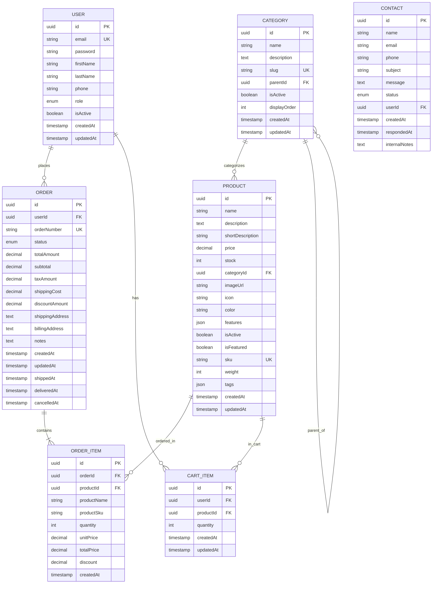
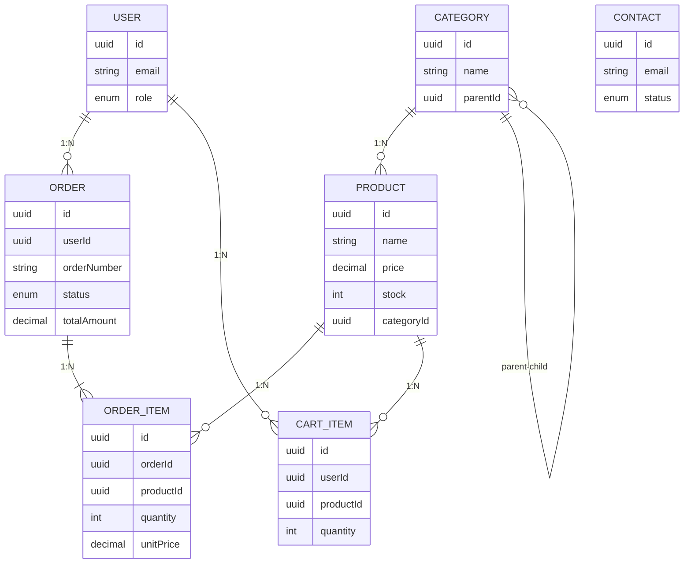
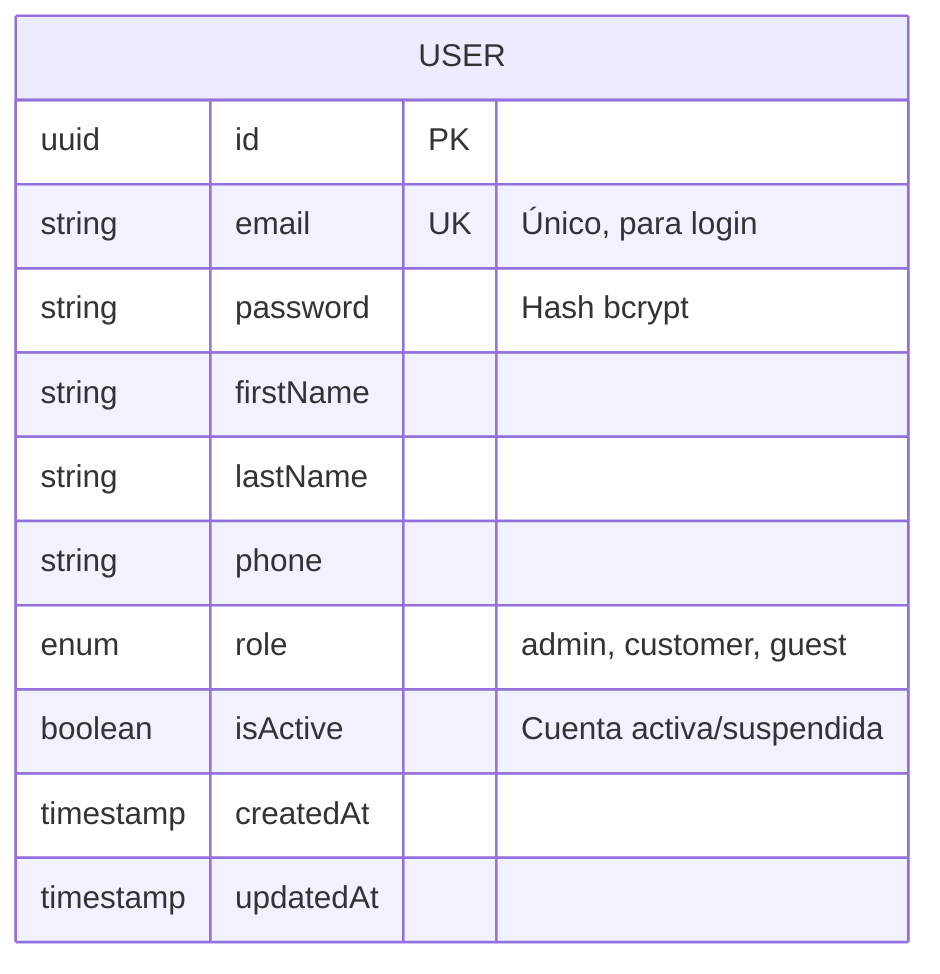
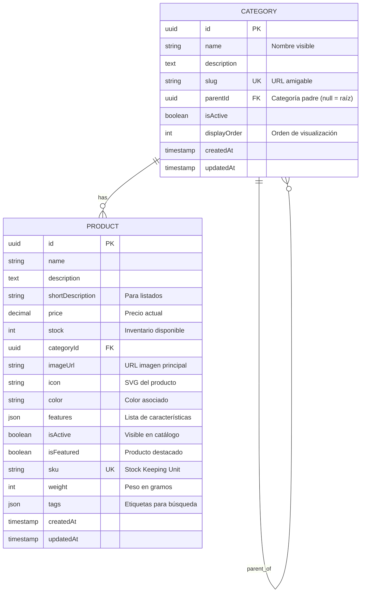
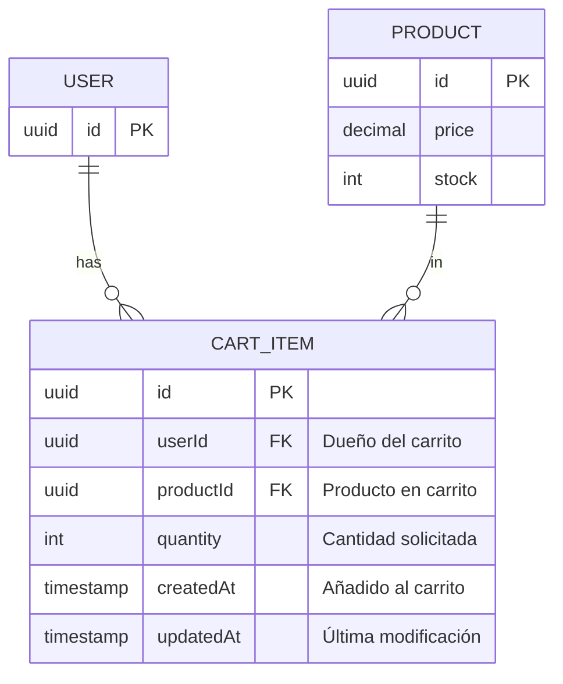
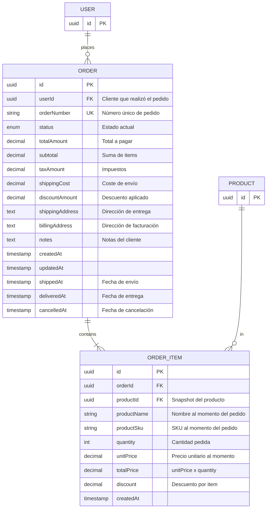
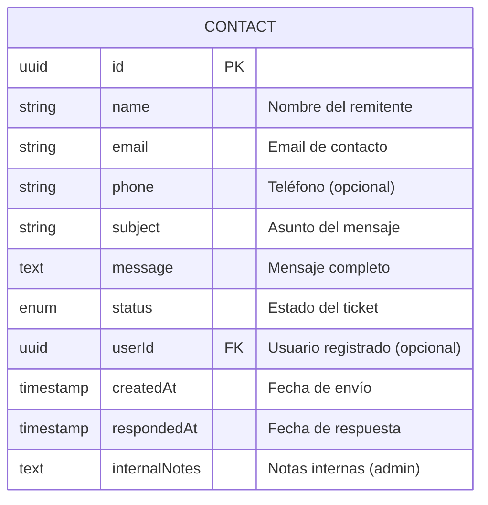

# Diagrama E/R Visual - BROADCASTTD

Este archivo contiene el diagrama entidad-relación en formato Mermaid para visualización en GitHub y editores compatibles.

## Diagrama Completo



## Diagrama Simplificado (Solo Relaciones Principales)



## Vista por Módulos

### Módulo de Usuarios y Autenticación



**Roles**:
- `ADMIN`: Administrador del sistema
- `CUSTOMER`: Cliente registrado
- `GUEST`: Usuario invitado (temporal)

### Módulo de Catálogo



**Jerarquía de Categorías**:
```
Cloud Computing (raíz)
├── IaaS (parentId: Cloud Computing)
├── PaaS (parentId: Cloud Computing)
└── SaaS (parentId: Cloud Computing)
```

### Módulo de Carrito



**Restricción Única**: `(userId, productId)` - Un usuario no puede tener el mismo producto duplicado en el carrito.

### Módulo de Pedidos



**Estados del Pedido**:
1. `PENDING` - Pendiente de pago/confirmación
2. `PROCESSING` - En proceso de preparación
3. `SHIPPED` - Enviado
4. `DELIVERED` - Entregado
5. `CANCELLED` - Cancelado
6. `REFUNDED` - Reembolsado

**Flujo de Estado**:
```
PENDING → PROCESSING → SHIPPED → DELIVERED
    ↓           ↓
CANCELLED   CANCELLED
    ↓
REFUNDED
```

### Módulo de Contacto



**Estados del Mensaje**:
1. `NEW` - Nuevo, sin leer
2. `IN_PROGRESS` - En revisión
3. `RESOLVED` - Resuelto
4. `CLOSED` - Cerrado

## Índices Principales

### Índices para Performance

```sql
-- USER
CREATE INDEX idx_user_email ON USER(email);
CREATE INDEX idx_user_role ON USER(role);

-- CATEGORY
CREATE UNIQUE INDEX idx_category_slug ON CATEGORY(slug);
CREATE INDEX idx_category_parent ON CATEGORY(parentId);
CREATE INDEX idx_category_active ON CATEGORY(isActive);

-- PRODUCT
CREATE UNIQUE INDEX idx_product_sku ON PRODUCT(sku);
CREATE INDEX idx_product_category ON PRODUCT(categoryId);
CREATE INDEX idx_product_active ON PRODUCT(isActive);
CREATE INDEX idx_product_featured ON PRODUCT(isFeatured);
CREATE INDEX idx_product_name ON PRODUCT(name); -- Para búsquedas

-- ORDER
CREATE UNIQUE INDEX idx_order_number ON ORDER(orderNumber);
CREATE INDEX idx_order_user ON ORDER(userId);
CREATE INDEX idx_order_status ON ORDER(status);
CREATE INDEX idx_order_created ON ORDER(createdAt);

-- ORDER_ITEM
CREATE INDEX idx_orderitem_order ON ORDER_ITEM(orderId);
CREATE INDEX idx_orderitem_product ON ORDER_ITEM(productId);

-- CART_ITEM
CREATE INDEX idx_cart_user ON CART_ITEM(userId);
CREATE INDEX idx_cart_product ON CART_ITEM(productId);
CREATE UNIQUE INDEX idx_cart_user_product ON CART_ITEM(userId, productId);

-- CONTACT
CREATE INDEX idx_contact_status ON CONTACT(status);
CREATE INDEX idx_contact_email ON CONTACT(email);
CREATE INDEX idx_contact_created ON CONTACT(createdAt);
```

## Restricciones de Integridad

### Foreign Keys con Políticas

```sql
-- ORDER
ALTER TABLE ORDER
  ADD CONSTRAINT fk_order_user
  FOREIGN KEY (userId) REFERENCES USER(id)
  ON DELETE CASCADE; -- Si se elimina el usuario, se eliminan sus pedidos

-- ORDER_ITEM
ALTER TABLE ORDER_ITEM
  ADD CONSTRAINT fk_orderitem_order
  FOREIGN KEY (orderId) REFERENCES ORDER(id)
  ON DELETE CASCADE; -- Si se elimina el pedido, se eliminan sus items

ALTER TABLE ORDER_ITEM
  ADD CONSTRAINT fk_orderitem_product
  FOREIGN KEY (productId) REFERENCES PRODUCT(id)
  ON DELETE RESTRICT; -- No permitir eliminar productos con pedidos

-- PRODUCT
ALTER TABLE PRODUCT
  ADD CONSTRAINT fk_product_category
  FOREIGN KEY (categoryId) REFERENCES CATEGORY(id)
  ON DELETE SET NULL; -- Si se elimina la categoría, productos quedan sin categoría

-- CATEGORY (auto-referencia)
ALTER TABLE CATEGORY
  ADD CONSTRAINT fk_category_parent
  FOREIGN KEY (parentId) REFERENCES CATEGORY(id)
  ON DELETE SET NULL; -- Si se elimina padre, hijos se convierten en raíz

-- CART_ITEM
ALTER TABLE CART_ITEM
  ADD CONSTRAINT fk_cart_user
  FOREIGN KEY (userId) REFERENCES USER(id)
  ON DELETE CASCADE; -- Si se elimina usuario, se elimina su carrito

ALTER TABLE CART_ITEM
  ADD CONSTRAINT fk_cart_product
  FOREIGN KEY (productId) REFERENCES PRODUCT(id)
  ON DELETE CASCADE; -- Si se elimina producto, se elimina del carrito
```

### Checks de Validación

```sql
-- USER
ALTER TABLE USER ADD CONSTRAINT chk_user_email CHECK (email LIKE '%@%');
ALTER TABLE USER ADD CONSTRAINT chk_user_password CHECK (LENGTH(password) >= 8);

-- PRODUCT
ALTER TABLE PRODUCT ADD CONSTRAINT chk_product_price CHECK (price >= 0);
ALTER TABLE PRODUCT ADD CONSTRAINT chk_product_stock CHECK (stock >= 0);

-- ORDER
ALTER TABLE ORDER ADD CONSTRAINT chk_order_amounts CHECK (totalAmount >= 0);

-- ORDER_ITEM
ALTER TABLE ORDER_ITEM ADD CONSTRAINT chk_orderitem_quantity CHECK (quantity > 0);
ALTER TABLE ORDER_ITEM ADD CONSTRAINT chk_orderitem_prices CHECK (unitPrice >= 0 AND totalPrice >= 0);

-- CART_ITEM
ALTER TABLE CART_ITEM ADD CONSTRAINT chk_cart_quantity CHECK (quantity > 0);
```

## Visualización en Herramientas

Para visualizar este diagrama:

1. **GitHub**: Renderiza automáticamente bloques Mermaid
2. **VS Code**: Instala la extensión "Markdown Preview Mermaid Support"
3. **Online**: Usa [mermaid.live](https://mermaid.live)
4. **Draw.io**: Importa como texto
5. **DbDiagram.io**: Convierte a su sintaxis

## Exportar a Otros Formatos

### SQL Create Tables (Ejemplo PostgreSQL)

Ver archivo completo en: `docs/database/schema.sql` (a crear en fase de implementación)

### TypeORM Entities

Las entidades TypeScript en `src/backend/models/` pueden convertirse directamente a entidades TypeORM añadiendo decoradores:

```typescript
import { Entity, Column, PrimaryGeneratedColumn } from 'typeorm';

@Entity('products')
export class Product {
  @PrimaryGeneratedColumn('uuid')
  id: string;

  @Column()
  name: string;

  // ... resto de campos con decoradores
}
```

---

**Nota**: Este diagrama visual complementa la documentación textual en [DATABASE_DESIGN.md](./DATABASE_DESIGN.md)
